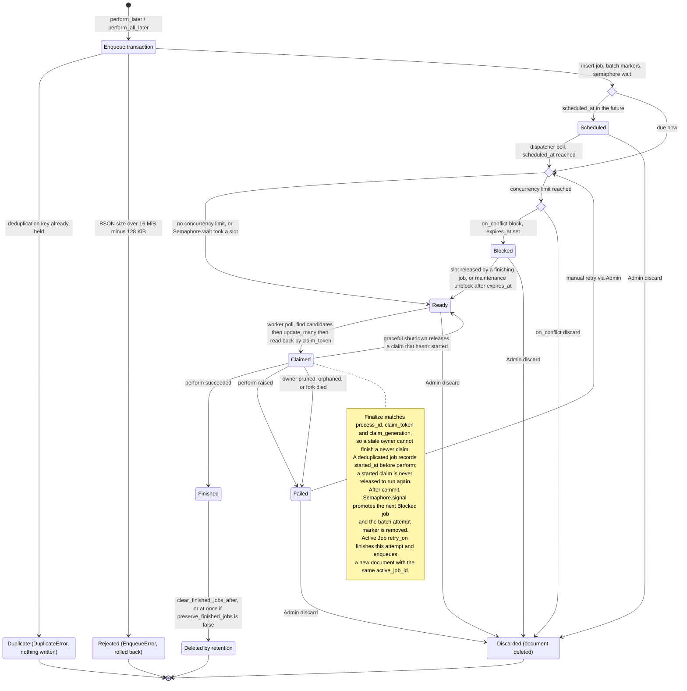

# Solid Queue

Solid Queue is a database-based queuing backend for [Active Job](https://edgeguides.rubyonrails.org/active_job_basics.html), designed with simplicity and performance in mind.

In addition to regular job enqueuing and processing, Solid Queue supports delayed jobs, concurrency controls, recurring jobs, pausing queues, numeric priorities per job, priorities by queue order, and bulk enqueuing (`enqueue_all` for Active Job's `perform_all_later`).

Solid Queue's default backend supports SQL databases such as MySQL, PostgreSQL, and SQLite, leveraging `FOR UPDATE SKIP LOCKED` where available to avoid blocking when polling jobs. An experimental native MongoDB backend is also available for transaction-capable replica sets and sharded clusters. Solid Queue relies on Active Job for retries, discarding, error handling, serialization, and delays, and supports multi-threaded and fiber-based workers.

## Table of Contents

- [Installation](#installation)
  - [Usage in development and other non-production environments](#usage-in-development-and-other-non-production-environments)
  - [Single database configuration](#single-database-configuration)
  - [Dashboard UI Setup](#dashboard-ui-setup)
  - [Experimental MongoDB backend](#experimental-mongodb-backend)
    - [MongoDB job lifecycle](#mongodb-job-lifecycle)
  - [Incremental adoption](#incremental-adoption)
  - [High performance requirements](#high-performance-requirements)
- [Workers, dispatchers, and scheduler](#workers-dispatchers-and-scheduler)
  - [Fork vs. async mode](#fork-vs-async-mode)
- [Configuration](#configuration)
  - [Optional scheduler configuration](#optional-scheduler-configuration)
  - [Queue order and priorities](#queue-order-and-priorities)
  - [Worker priority ranges](#worker-priority-ranges)
  - [Queues specification and performance](#queues-specification-and-performance)
  - [Threads, processes, and signals](#threads-processes-and-signals)
  - [Database configuration](#database-configuration)
  - [Other configuration settings](#other-configuration-settings)
  - [Draining queues and working off jobs](#draining-queues-and-working-off-jobs)
  - [Operations tasks](#operations-tasks)
  - [Validating the configuration](#validating-the-configuration)
- [Lifecycle hooks](#lifecycle-hooks)
- [Errors when enqueuing](#errors-when-enqueuing)
- [Concurrency controls](#concurrency-controls)
  - [Performance considerations](#performance-considerations)
- [Deduplication](#deduplication)
- [Failed jobs and retries](#failed-jobs-and-retries)
  - [Error reporting on jobs](#error-reporting-on-jobs)
  - [Jobs interrupted by non-graceful process death](#jobs-interrupted-by-non-graceful-process-death)
- [Batch jobs](#batch-jobs)
  - [Batch progress and counters](#batch-progress-and-counters)
  - [Batch maintenance](#batch-maintenance)
  - [Clearing batches](#clearing-batches)
  - [Upgrading existing installations](#upgrading-existing-installations)
- [Puma plugin](#puma-plugin)
- [Jobs and transactional integrity](#jobs-and-transactional-integrity)
- [Recurring tasks](#recurring-tasks)
  - [Scheduling and unscheduling recurring tasks dynamically](#scheduling-and-unscheduling-recurring-tasks-dynamically)
- [Inspiration](#inspiration)
- [License](#license)


## Installation

New Rails 8 applications configure Solid Queue with the default SQL backend. For earlier Rails versions, install that backend as follows. To use MongoDB, follow the [native installation](#experimental-mongodb-backend) instead.

1. `bundle add solid_queue`
2. `bin/rails solid_queue:install`

(Note: The minimum supported version of Rails is 7.1 and Ruby is 3.2.)

This will configure Solid Queue as the production Active Job backend, create the configuration files `config/queue.yml` and `config/recurring.yml`, and create the `db/queue_schema.rb`. It'll also create a `bin/jobs` executable wrapper that you can use to start Solid Queue.

Once you've done that, you will have to add the configuration for the queue database in `config/database.yml`. If you're using SQLite, it'll look like this:

```yaml
production:
  primary:
    <<: *default
    database: storage/production.sqlite3
  queue:
    <<: *default
    database: storage/production_queue.sqlite3
    migrations_paths: db/queue_migrate
```

...or if you're using MySQL/PostgreSQL/Trilogy:

```yaml
production:
  primary: &primary_production
    <<: *default
    database: app_production
    username: app
    password: <%= ENV["APP_DATABASE_PASSWORD"] %>
  queue:
    <<: *primary_production
    database: app_production_queue
    migrations_paths: db/queue_migrate
```

Then run `db:prepare` in production to ensure the database is created and the schema is loaded.

Now you're ready to start processing jobs by running `bin/jobs` on the server that's doing the work. This will start processing jobs in all queues using the default configuration. See [below](#configuration) to learn more about configuring Solid Queue.

For small projects, you can run Solid Queue on the same machine as your webserver. When you're ready to scale, Solid Queue supports horizontal scaling out-of-the-box. You can run Solid Queue on a separate server from your webserver, or even run `bin/jobs` on multiple machines at the same time. Depending on the configuration, you can designate some machines to run only dispatchers or only workers. See the [configuration](#configuration) section for more details on this.

**Note**: Future changes to the schema will come in the form of regular migrations.

### Usage in development and other non-production environments

Calling `bin/rails solid_queue:install` will automatically add `config.solid_queue.connects_to = { database: { writing: :queue } }` to `config/environments/production.rb`. In order to use Solid Queue in other environments (such as development or staging), you'll need to add a similar configuration(s).

For example, if you're using SQLite in development, update `database.yml` as follows:

```diff
development:
+ primary:
    <<: *default
    database: storage/development.sqlite3
+ queue:
+   <<: *default
+   database: storage/development_queue.sqlite3
+   migrations_paths: db/queue_migrate
```

Next, add the following to `development.rb`

```ruby
  # Use Solid Queue in Development.
  config.active_job.queue_adapter = :solid_queue
  config.solid_queue.connects_to = { database: { writing: :queue } }
```

Once you've added this, run `db:prepare` to create the Solid Queue database and load the schema.

Finally, in order for jobs to be processed, you'll need to have Solid Queue running. In Development, this can be done via [the Puma plugin](#puma-plugin) as well. In `puma.rb` update the following line:

```ruby
# You can either set the env var, or check for development
plugin :solid_queue if ENV["SOLID_QUEUE_IN_PUMA"] || Rails.env.development?
```

You can also just use `bin/jobs`, but in this case you might want to [set a different logger for Solid Queue](#other-configuration-settings) because the default logger will log to `log/development.log` and you won't see anything when you run `bin/jobs`. For example:
```ruby
config.solid_queue.logger = ActiveSupport::Logger.new(STDOUT)
```

**Note about Action Cable**: If you use Action Cable (or anything dependent on Action Cable, such as Turbo Streams), you will also need to update it to use a database.

In `config/cable.yml`

```diff
development:
-  adapter: async
+  adapter: solid_cable
+  connects_to:
+    database:
+      writing: cable
+  polling_interval: 0.1.seconds
+  message_retention: 1.day
```

In `config/database.yml`

```diff
development:
  primary:
    <<: *default
    database: storage/development.sqlite3
+  cable:
+    <<: *default
+    database: storage/development_cable.sqlite3
+    migrations_paths: db/cable_migrate
```

### Single database configuration

With the **SQL backend**, a separate queue database is recommended. You can also use one database for application and queue tables:

1. Copy the contents of `db/queue_schema.rb` into a normal migration and delete `db/queue_schema.rb`
2. Remove `config.solid_queue.connects_to` from `production.rb`
3. Migrate your database. You are ready to run `bin/jobs`

You won't have multiple databases, so `database.yml` doesn't need to have primary and queue database.

### Dashboard UI Setup

For viewing information about your jobs via a UI, we recommend taking a look at [mission_control-jobs](https://github.com/rails/mission_control-jobs), a dashboard where, among other things, you can examine and retry/discard failed jobs.

Solid Queue exposes a backend-neutral `SolidQueue::Admin` API for queue, job, batch, process, and recurring-task queries and actions. For MongoDB, use this API for administrative integrations. A dashboard adaptation has exercised Mongo-backed queue and failed-job pages, failed-job detail, pause/resume, and retry; the released dashboard currently targets Active Record.

Administrative clients should use this public surface instead of chaining backend-specific relations:

- Queues: `queues`, `queue_size`, `clear_queue`, `pause_queue`, `resume_queue`, and `queue_paused?`.
- Jobs: `jobs`, `jobs_count`, `failures`, `failures_count`, `find_job`, `retry_job`, `retry_jobs`, `discard_job`, `discard_jobs`, `dispatch_job`, and `job_attributes`. Job statuses are `:pending`, `:failed`, `:in_progress`, `:blocked`, `:scheduled`, and `:finished`.
- Batches: `batches`, `batches_count`, `find_batch`, and `batch_job_counts`.
- Processes: `processes`, `processes_count`, and `find_process`.
- Recurring tasks: `recurring_tasks`, `find_recurring_task`, `recurring_last_enqueued_at`, `enqueue_recurring_task`, and `recurring_task_valid?`.

All methods are module methods on `SolidQueue::Admin`. Query methods accept the pagination and filters declared by their Ruby signatures and return model objects, `SolidQueue::Admin::QueueInfo` values, or plain counts/hashes—not an Active Record relation.

For example, in a Rails console on either backend:

```ruby
admin = SolidQueue::Admin
admin.queues(name: "default").map { |queue| [queue.name, queue.size, queue.paused] }
admin.jobs(status: :pending, queue_name: "default", limit: 20)
admin.failures(limit: 20)
job = admin.find_job(active_job_id, status: :failed)
admin.job_attributes(job, status: :failed) if job
admin.retry_job(active_job_id) # or admin.discard_job(active_job_id, status: :failed)
admin.pause_queue("default")
admin.resume_queue("default")
admin.batches(status: :unfinished, limit: 20)
admin.processes(kind: "Worker")
admin.recurring_tasks
```

Use an Active Job ID for `find_job` and single-job actions. `jobs` takes a `status:` of `:pending`, `:failed`, `:in_progress`, `:blocked`, `:scheduled`, or `:finished`; `find_job` also accepts no status. Job filters include `queue_name:`, `job_class_name:`, `batch_id:`, `recurring_task_id:`, and time filters (`enqueued_at:`, `scheduled_at:`, `finished_at:`); `worker_id:` applies to `:in_progress`. Use `offset:`/`limit:` to bound list queries. `batches` accepts `:finished`, `:unfinished`, or `:failed`. `clear_queue` discards ready jobs in that queue through the API. See [failed-job recovery](#failed-jobs-and-retries) and [batch counters](#batch-progress-and-counters).

### Experimental MongoDB backend

Solid Queue includes an **experimental** native MongoDB backend. It uses the MongoDB Ruby Driver directly for queue persistence and doesn't use or integrate with Mongoid. The existing Active Record backend remains the default and its installation and configuration are unchanged.

The MongoDB backend requires Ruby 3.2 or newer, Rails 7.1 or newer, MongoDB Ruby Driver `mongo >= 2.24, < 3`, and a transaction-capable MongoDB replica set or sharded cluster. A standalone `mongod` is rejected rather than run with weaker guarantees.

For a new driver-only installation, select MongoDB when running the installer:

```bash
bundle add solid_queue
bin/rails generate solid_queue:install --backend=mongodb
bundle install
```

The generator adds the supported `mongo` dependency to the application's Gemfile.

When switching an existing installation between storage backends, drain its pending, scheduled, blocked, and failed work and switch producers and processes together. See [Upgrading](UPGRADING.md) for the cutover steps.

Configure a replica-set URI and select the backend. The generator adds the backend setting to `config/application.rb`, so every environment and the `solid_queue:*` tasks use MongoDB. Set `backend` in `config/application.rb` or an environment file, not in `config/initializers`: it's read before initializers run. Other settings can go anywhere:

```ruby
# config/application.rb
config.solid_queue.backend = :mongodb

# config/environments/production.rb
config.active_job.queue_adapter = :solid_queue
config.solid_queue.mongo_url = ENV.fetch("MONGODB_URI")
```

The URI may select the queue database. Alternatively, set `config.solid_queue.mongo_database`; it overrides the database from the URI:

```ruby
config.solid_queue.mongo_database = "my_app_queue"
```

Then create the collections and indexes before starting any Solid Queue process, and check the process configuration for the target environment:

```bash
RAILS_ENV=production bin/rails solid_queue:prepare
RAILS_ENV=production bin/jobs check
RAILS_ENV=production bin/jobs
```

`solid_queue:prepare` validates transaction support and creates or updates the required collections and indexes. Run it again when an upgrade changes the index manifest. MongoDB queue storage uses this task instead of the SQL schema, migrations, `config.solid_queue.connects_to`, and `db:prepare`. `check` validates process and recurring configuration and warns about a small Mongo driver pool. If startup reports missing collections or indexes, run `prepare` against the same URI/database configured for the processes.

The default URI is `ENV["MONGODB_URI"]`, falling back to `mongodb://127.0.0.1:27017/solid_queue`. You can instead supply an existing `Mongo::Client`, or a callable that returns one:

```ruby
config.solid_queue.mongo_client = -> { MyMongoClients.queue }
```

Solid Queue creates a separate driver client in every fork. Size the Mongo driver's `max_pool_size` **per process**: a thread or fiber worker needs a practical minimum of its configured execution capacity plus one polling and one heartbeat connection. Unlike the Rails 7.2+ SQL guidance [below](#threads-processes-and-signals), MongoDB fiber capacity is included in this estimate. In fork mode, apply it independently to each worker process; in async-supervisor mode, add the concurrent requirements of all actors sharing the process. Set the option on the Mongo URI or supplied client, not in `database.yml`. An externally supplied client must be suitable for that process; Solid Queue rebuilds a fork-safe child client from it after a fork. Do not share sessions across threads or fibers. Mongo session context is stored in `ActiveSupport::IsolatedExecutionState`; fiber workers require `config.active_support.isolation_level = :fiber` and the `async` gem as described [below](#threads-processes-and-signals).

The MongoDB backend registers an Active Job serializer for `BSON::ObjectId`, so ObjectIds, including nested ones, can be job arguments.

#### MongoDB transactions and delivery guarantees

Queue coordination uses primary reads, majority-acknowledged writes, and short transactions. `config.solid_queue.mongo_transaction_timeout` bounds how long transient-error retries of a transaction, and retries of its commit, may continue; it defaults to 5 seconds and doesn't limit how long a single attempt runs. A limited or batched enqueue that exceeds it raises `SolidQueue::Job::EnqueueError`. The driver's transaction block can run again after a transient error, so keep external side effects out of it.

Application writes and queue writes are atomic only when both use the **same `Mongo::Client` and the same explicit `Mongo::Session`**. Scope a caller-owned session around enqueueing with:

```ruby
client.start_session do |session|
  session.with_transaction do
    SolidQueue.with_mongo_session(session, client: client) do
      client[:accounts].update_one(
        { _id: account_id },
        { "$set" => { status: "ready" } },
        session: session
      )
      AccountReadyJob.perform_later(account_id)
    end
  end
end
```

The supplied client must own the session. Pass the session explicitly to application driver calls, as in the example. The Ruby Driver has no commit callback for a caller-owned transaction; dispatchers with batch and concurrency maintenance enabled repair deferred batch completion and blocked-job promotion after it commits.

If application data and the queue use separate clients or databases that cannot participate in one transaction, an `after_commit` enqueue is not a loss-free handoff: the application can commit and the enqueue can still fail. Use a transactional outbox in the application's database when loss-free cross-database handoff is required.

MongoDB queue, job, process, and batch IDs exposed by Solid Queue are strings. Inside a queue, jobs are polled by ascending priority then ObjectId. ObjectIds have second-level timestamp precision, so jobs enqueued by different processes within one second may run in either order. Explicit queue order still takes precedence over job priority; see [queue order and priorities](#queue-order-and-priorities).

MongoDB's 16 MiB BSON document limit also bounds serialized jobs. Active Job payloads are persisted as JSON inside the BSON document, preserving integers larger than BSON int64 when Active Job can serialize them. Solid Queue rejects an enqueue before writing when the job document exceeds 16 MiB minus a 128 KiB lifecycle reserve, raising `SolidQueue::Job::EnqueueError`. Constrained and batched enqueue transactions roll back atomically on this rejection. Failure metadata uses a 64 KiB envelope (exception class 1 KiB, message 16 KiB, and at most 64 backtrace lines of 512 bytes) to leave room for a job to transition to failed.

Majority durability protects committed queue state; it does not make execution side effects exactly once. Without deduplication, Solid Queue provides at-least-once processing across failures and retries, so jobs that affect external systems must be idempotent. [Deduplication](#deduplication) gives at most one execution per attempt and one live job per key.

#### MongoDB job lifecycle

Each job attempt is one document in `solid_queue_jobs`, and its `state` field moves through the states below. Enqueueing runs in your application; the dispatcher polls scheduled jobs and runs concurrency maintenance; workers claim and perform ready jobs; the supervisor fails claims whose process died.



A claimed job can't be discarded. Automatic Active Job retries create a new attempt document with the same `active_job_id`, so batch counts and deduplication treat them as one logical job.

#### MongoDB logging, health, and notifications

`config.solid_queue.silence_polling` defaults to `true` and suppresses polling output from the Mongo driver logger. Low-volume driver health notifications are enabled by default:

- `mongo_primary_change.solid_queue`
- `mongo_server_unavailable.solid_queue`
- `mongo_pool_checkout_failed.solid_queue`
- `mongo_pool_checkout_wait.solid_queue`

Transaction retries and deadline failures emit `transaction_retry.solid_queue`, including `operation`, `error_label`, `attempt`, `transaction_attempt`, `phase`, `deadline_exceeded`, and `error`. Mongo claim events add candidate and claimed counts to `claim.solid_queue`. IDs in Mongo-backed notification payloads are strings.

Command monitoring runs on every database operation, including every poll, and is disabled by default. Enable it only when that volume is intentional:

```ruby
config.solid_queue.mongo_command_monitoring = true
```

It emits `mongo_command.solid_queue`. All of these events are handled by Solid Queue's log subscriber. For operational triage, inspect `SolidQueue::Admin.processes`, queue sizes, and failures alongside heartbeat age (`process_heartbeat_interval` defaults to 60 seconds; `process_alive_threshold` to 5 minutes). For individual stuck jobs, use an application timeout or watchdog alongside process heartbeats.

#### MongoDB verification and benchmarks

The repository includes MongoDB tests (`test/mongodb`), a Docker runner (`test/mongodb/run_matrix.rb`), and a persistence benchmark (`benchmarks/run`). CI and the runner test two lanes: pinned (Ruby 4.0.2, Rails 8.0.5.1, `mongo` 2.26.0, MongoDB 8.0) and latest (Ruby 4.0.7, Rails 8.1.3.1, `mongo` 2.26.0, MongoDB 8.3). The fault tests require a dedicated replica set with test commands enabled. The benchmark records its environment and comparison under `tmp/benchmarks`; measure your production topology separately.

### Incremental adoption

If you're planning to adopt Solid Queue incrementally by switching one job at the time, you can do so by leaving the `config.active_job.queue_adapter` set to your old backend, and then set the `queue_adapter` directly in the jobs you're moving:

```ruby
# app/jobs/my_job.rb

class MyJob < ApplicationJob
  self.queue_adapter = :solid_queue
  # ...
end
```

### High performance requirements

For the SQL backend, Solid Queue was designed for the highest throughput with MySQL 8+, MariaDB 10.6+, or PostgreSQL 9.5+ because they support `FOR UPDATE SKIP LOCKED`; older versions may encounter lock waits, and SQLite suits smaller applications. This guidance is not a MongoDB performance claim; the native backend uses its own indexed polling and has no published performance parity guarantee.

## Workers, dispatchers, and scheduler

We have several types of actors in Solid Queue:

- _Workers_ pick ready jobs and process them. SQL stores ready executions in `solid_queue_ready_executions`; MongoDB stores ready state in `solid_queue_jobs`.
- _Dispatchers_ promote due scheduled jobs for workers and perform [concurrency](#concurrency-controls) and [batch maintenance](#batch-maintenance). SQL moves rows between execution tables; MongoDB transitions job document state.
- The _scheduler_ manages [recurring tasks](#recurring-tasks), enqueuing jobs for them when they're due.
- The _supervisor_ runs workers and dispatchers according to the configuration, controls their heartbeats, and stops and starts them when needed.

### Fork vs. async mode

By default, Solid Queue runs in `fork` mode. This means the supervisor will fork a separate process for each supervised worker/dispatcher/scheduler. This provides the best isolation and performance, but can have additional memory usage and might not work with some Ruby implementations. As an alternative, you can run all workers, dispatchers and schedulers in the same process as the supervisor, in different threads, with an `async` mode. You can choose this mode by running `bin/jobs` as:

```
bin/jobs --mode async
```

Or you can also set the environment variable `SOLID_QUEUE_SUPERVISOR_MODE` to `async`. If you use the `async` mode, the `processes` option in the configuration described below will be ignored.

**The recommended and default mode is `fork`. Only use `async` if you know what you're doing and have strong reasons to**

This supervisor mode is separate from a worker's concurrency model. Supervisor mode decides whether supervised processes live in forks or threads. Worker configuration decides whether claimed jobs run in a thread pool (`threads: N`) or as fibers on a single fiber reactor thread (`fibers: N`).

Because these are separate concerns, you can combine the default `fork` supervisor mode with fiber workers. In that setup, each worker process gets its own fiber reactor and bounded fiber count.

## Configuration

By default, Solid Queue will try to find your configuration under `config/queue.yml`, but you can set a different path using the environment variable `SOLID_QUEUE_CONFIG` or by using the `-c/--config_file` option with `bin/jobs`, like this:

```
bin/jobs -c config/calendar.yml
```

You can also skip the scheduler process by setting the environment variable `SOLID_QUEUE_SKIP_RECURRING=true`. This is useful for environments like staging, review apps, or development where you don't want any recurring jobs to run. This is equivalent to using the `--skip-recurring` option with `bin/jobs`.

To run **only** the scheduler (no workers or dispatchers)—for example to isolate recurring tasks on a dedicated process—set `SOLID_QUEUE_ONLY_RECURRING=true` or use the `--only-recurring` option with `bin/jobs`.

This is what this configuration looks like:

```yml
production:
  dispatchers:
    - polling_interval: 1
      batch_size: 500
      concurrency_maintenance_interval: 300
  workers:
    - queues: "*"
      threads: 3
      polling_interval: 2
    - queues: [ real_time, background ]
      threads: 5
      polling_interval: 0.1
      processes: 3
    - queues: "api*"
      fibers: 100
      polling_interval: 0.05
  scheduler:
    dynamic_tasks_enabled: true
    polling_interval: 5

```

Everything is optional. If no configuration at all is provided, Solid Queue will run with one dispatcher and one worker with default settings. If you want to run only dispatchers or workers, you just need to include that section alone in the configuration. For example, with the following configuration:

```yml
production:
  dispatchers:
    - polling_interval: 1
      batch_size: 500
      concurrency_maintenance_interval: 300
```
the supervisor will run 1 dispatcher and no workers.


Here's an overview of the different options:

- `polling_interval`: the time interval in seconds that workers and dispatchers will wait before checking for more jobs. This time defaults to `1` second for dispatchers and `0.1` seconds for workers.
- `batch_size`: the dispatcher will dispatch jobs in batches of this size. The default is 500.
- `concurrency_maintenance_interval`: the time interval in seconds that the dispatcher will wait before checking for blocked jobs that can be unblocked. Read more about [concurrency controls](#concurrency-controls) to learn more about this setting. It defaults to `600` seconds.
- `queues`: the list of queues that workers will pick jobs from. You can use `*` to indicate all queues (which is also the default and the behaviour you'll get if you omit this). You can provide a single queue, or a list of queues as an array. Jobs will be polled from those queues in order, so for example, with `[ real_time, background ]`, no jobs will be taken from `background` unless there aren't any more jobs waiting in `real_time`. You can also provide a prefix with a wildcard to match queues starting with a prefix. For example:

  ```yml
  staging:
    workers:
      - queues: staging*
        threads: 3
        polling_interval: 5

  ```

  This will create a worker fetching jobs from all queues starting with `staging`. The wildcard `*` is only allowed on its own or at the end of a queue name; you can't specify queue names such as `*_some_queue`. These will be ignored.
  
  Also, if a wildcard (*) is included alongside explicit queue names, for example: `queues: [default, backend, *]`, then it would behave like `queues: *`

  Finally, you can combine prefixes with exact names, like `[ staging*, background ]`, and the behaviour with respect to order will be the same as with only exact names.

  Check the sections below on [how queue order behaves combined with priorities](#queue-order-and-priorities), and [how the way you specify the queues per worker might affect performance](#queues-specification-and-performance).

- `threads`: configures a worker to execute jobs in a thread pool of this size. By default, workers use `threads: 3`. Only workers have this setting, and it can't be combined with `fibers`.
For SQL, set `threads` no higher than the queue database pool size minus two as a starting point. For MongoDB, size the driver's `max_pool_size` per process by the same capacity-plus-polling-and-heartbeat baseline; see [MongoDB connection and fork guidance](#experimental-mongodb-backend).
- `fibers`: configures a worker to execute jobs as fibers on a single fiber reactor thread, with this value as the maximum number of in-flight jobs. It can't be combined with `threads`.
  Fiber workers require the `async` gem and fiber-scoped isolated execution state. In Rails apps, set `config.active_support.isolation_level = :fiber` before using `fibers`; Solid Queue refuses to boot otherwise. For **SQL** on Rails 7.2 and later, a practical starting point is usually `3-5` queue database connections per worker process rather than matching `fibers`, because ordinary Active Record query paths can release connections between non-blocking waits. On Rails 7.1, size the SQL pool more conservatively. For **MongoDB**, budget the configured fiber count plus polling and heartbeat in the Mongo driver pool.
- `processes`: this is the number of worker processes that will be forked by the supervisor with the settings given. By default, this is `1`, just a single process. This setting is useful if you want to dedicate more than one CPU core to a queue or queues with the same configuration. Only workers have this setting. This works with both `threads` and `fibers` workers as long as the supervisor is running in the default `fork` mode. **Note**: this option is ignored only when the supervisor itself is [running in `async` mode](#fork-vs-async-mode).
- `concurrency_maintenance`: whether the dispatcher will perform the concurrency maintenance work. This is `true` by default, and it's useful if you don't use any [concurrency controls](#concurrency-controls) and want to disable it or if you run multiple dispatchers and want some of them to just dispatch jobs without doing anything else.
- `min_priority` / `max_priority`: limit a worker to jobs within this priority range (inclusive, either bound optional). See [worker priority ranges](#worker-priority-ranges).
- `exit_on_complete`: stop the supervisor once this worker finds nothing left to run. See [draining queues](#draining-queues-and-working-off-jobs).
- `batch_maintenance`: whether the dispatcher will sweep stalled [batches](#batch-jobs) as part of its maintenance work, on the same timer as concurrency maintenance (see [batch maintenance](#batch-maintenance)). This is `true` by default; disable it if you don't use batches, or if you run multiple dispatchers and want only some of them doing maintenance work.


### Optional scheduler configuration

Optionally, you can configure the scheduler process under the `scheduler` section in your `config/queue.yml` if you'd like to [schedule recurring tasks dynamically](#scheduling-and-unscheduling-recurring-tasks-dynamically).

```yaml
scheduler:
  dynamic_tasks_enabled: true
  polling_interval: 5
```

- `dynamic_tasks_enabled`: whether the scheduler should poll for [dynamically scheduled recurring tasks](#scheduling-and-unscheduling-recurring-tasks-dynamically). This is `false` by default. When enabled, the scheduler will poll the database at the given `polling_interval` to pick up tasks scheduled via `SolidQueue.schedule_recurring_task`.
- `polling_interval`: how frequently (in seconds) the scheduler checks for dynamic task changes. Defaults to `5`.

### Queue order and priorities

As mentioned above, if you specify a list of queues for a worker, these will be polled in the order given, such as for the list `real_time,background`, no jobs will be taken from `background` unless there aren't any more jobs waiting in `real_time`.

Active Job also supports positive integer priorities when enqueuing jobs. In Solid Queue, the smaller the value, the higher the priority. The default is `0`.

This is useful when you run jobs with different importance or urgency in the same queue. Within the same queue, jobs will be picked in order of priority, but in a list of queues, the queue order takes precedence, so in the previous example with `real_time,background`, jobs in the `real_time` queue will be picked before jobs in the `background` queue, even if those in the `background` queue have a higher priority (smaller value) set.

We recommend not mixing queue order with priorities but either choosing one or the other, as that will make job execution order more straightforward for you.

### Worker priority ranges

A worker can take only jobs within a priority range, for example to dedicate processes to urgent work:

```yml
production:
  workers:
    - queues: "*"
      max_priority: 10
    - queues: "*"
      min_priority: 11
```

Either bound can be omitted, and both are inclusive. `min_priority` can't be greater than `max_priority`. The range narrows the regular poll, which uses the same indexes on both backends. The worker's registered metadata and process title show it, e.g. `waiting for jobs in * with priorities 0..10`.

### Queues specification and performance

The following SQL queries and index discussion apply only to the Active Record backend. For MongoDB, `solid_queue:prepare` creates partial indexes over ready, scheduled, blocked, and other job states; polling sorts by priority then ObjectId, with queue ordering as described above. Prefix queues and pauses require discovery rather than a single exact-queue indexed poll on either backend, so prefer exact queue names for predictable polling cost.
```sql
-- No filtering by queue
SELECT job_id
FROM solid_queue_ready_executions
ORDER BY priority ASC, job_id ASC
LIMIT ?
FOR UPDATE SKIP LOCKED;

-- Filtering by a single queue
SELECT job_id
FROM solid_queue_ready_executions
WHERE queue_name = ?
ORDER BY priority ASC, job_id ASC
LIMIT ?
FOR UPDATE SKIP LOCKED;
```

The first one (no filtering by queue) is used when you specify
```yml
queues: *
```
and there aren't any queues paused, as we want to target all queues.

In other cases, we need to have a list of queues to filter by, in order, because we can only filter by a single queue at a time to ensure we use an index to sort. This means that if you specify your queues as:
```yml
queues: beta*
```

we'll need to get a list of all existing queues matching that prefix first, with a query that would look like this:
```sql
SELECT DISTINCT(queue_name)
FROM solid_queue_ready_executions
WHERE queue_name LIKE 'beta%';
```

This type of `DISTINCT` query on a column that's the leftmost column in an index can be performed very fast in MySQL thanks to a technique called [Loose Index Scan](https://dev.mysql.com/doc/refman/8.0/en/group-by-optimization.html#loose-index-scan). PostgreSQL doesn't implement this technique natively, so Solid Queue uses a [recursive CTE](https://www.postgresql.org/docs/current/queries-with.html#QUERIES-WITH-RECURSIVE) to emulate it, achieving similar performance by walking the B-tree index and jumping between distinct values. SQLite doesn't implement loose index scan either, but this is unlikely to be a problem since SQLite is typically used in development with small datasets.

Similarly to using prefixes, the same will happen if you have paused queues, because we need to get a list of all queues with a query like
```sql
SELECT DISTINCT(queue_name)
FROM solid_queue_ready_executions
```

and then remove the paused ones. Pausing in general should be something rare, used in special circumstances, and for a short period of time. If you don't want to process jobs from a queue anymore, the best way to do that is to remove it from your list of queues.

💡 To sum up, **if you want to ensure optimal performance on polling**, the best way to do that is to always specify exact names for them, and not have any queues paused.

Do this:

```yml
queues: [ background, backend ]
```

instead of this:
```yml
queues: back*
```


### Threads, processes, and signals

By default, workers in Solid Queue use a thread pool to run work in multiple threads, configurable via the `threads` parameter above. Workers can also be configured with `fibers`, in which case claimed jobs are executed as fibers on a single reactor thread and bounded by the worker's fiber count. Besides this, parallelism can be achieved via multiple processes on one machine (configurable via different workers or the `processes` parameter above) or by horizontal scaling.

Fiber worker execution is best suited for cooperative, mostly I/O-bound jobs. Blocking or CPU-heavy work still blocks the single reactor thread, so it should not be expected to outperform thread mode for every workload.

Because fiber workers run multiple fibers on a single thread, Rails must also isolate execution state per fiber rather than per thread. If your app keeps the default thread-scoped isolation level, Solid Queue will raise a boot-time error instead of running fiber workers with shared Active Record state.

Keep in mind that `config.active_support.isolation_level = :fiber` applies to your whole application, not just to Solid Queue: if you run Solid Queue inside Puma via [the plugin](#puma-plugin), or combine fiber workers with thread workers in the same process using the supervisor's `async` mode, everything in that process will use fiber-scoped execution state. This is fully supported by Rails, but it's a global setting worth being deliberate about.

For **SQL on Rails 7.2 and later**, fiber workers can often use a much smaller queue database pool than an equivalent thread pool. A practical starting point is `3-5` queue database connections per worker process: one for job execution, one for polling, one for heartbeats, plus some headroom. In the default `fork` supervisor mode, that guidance applies per worker process. In supervisor `async` mode, all workers share one process, so add together the requirements for the workers running there. MongoDB driver pools instead need capacity for in-flight fibers plus polling and heartbeat.

That lower SQL-pool guidance depends on job code not holding connections open across non-blocking waits. APIs such as `ActiveRecord::Base.connection`, `lease_connection`, `connection_pool.checkout`, or long-lived `with_connection` / transaction blocks can pin connections and push fiber workers back toward thread-like pool usage. On Rails 7.1, plan conservatively and assume the configured fiber count can still grow SQL queue database connection usage.

The supervisor is in charge of managing these processes, and it responds to the following signals when running in its own process via `bin/jobs` or with [the Puma plugin](#puma-plugin) with the default `fork` mode:
- `TERM`, `INT`: starts graceful termination. The supervisor will send a `TERM` signal to its supervised processes, and it'll wait up to `SolidQueue.shutdown_timeout` time until they're done. If any supervised processes are still around by then, it'll send a `QUIT` signal to them to indicate they must exit.
- `QUIT`: starts immediate termination. The supervisor will send a `QUIT` signal to its supervised processes, causing them to exit immediately.

When receiving a `QUIT` signal, if workers still have jobs in-flight, these will be returned to the queue when the processes are deregistered.

On Windows, the `QUIT` signal can't be trapped, so the supervisor only responds to `TERM` and `INT` there.

If processes have no chance of cleaning up before exiting (e.g. if someone pulls a cable somewhere), in-flight jobs might remain claimed by the processes executing them. Processes send heartbeats, and the supervisor checks and prunes processes with expired heartbeats. Jobs that were claimed by processes with an expired heartbeat will be marked as failed with a `SolidQueue::Processes::ProcessPrunedError`. You can configure both the frequency of heartbeats and the threshold to consider a process dead. See the section below for this.

Worker heartbeats are driven by a separate timer task, not by the worker execution backend itself. This means fiber workers do not rely on the reactor loop to prove liveness. However, liveness is still tracked at the worker-process level, not at the individual thread or fiber level.

This means finished and failed jobs still follow the normal Solid Queue lifecycle, but a single stuck job can remain claimed if the worker process itself is still alive. If you need stronger stuck-job detection, that requires an explicit timeout or watchdog mechanism on top of process heartbeats.

In a similar way, if a worker is terminated in any other way not initiated by the above signals (e.g. a worker is sent a `KILL` signal), jobs in progress will be marked as failed so that they can be inspected, with a `SolidQueue::Processes::ProcessExitError`. Sometimes a job in particular is responsible for this, for example, if it has a memory leak and you have a mechanism to kill processes over a certain memory threshold, so this will help identifying this kind of situation.


### Database configuration

For the **Active Record backend**, configure the database via `config.solid_queue.connects_to` in `config/application.rb` or an environment config. By default, a single database called `queue` is used for writing and reading to match the SQL installation configuration. All Active Record multiple-database options are available here. For native MongoDB, use `mongo_url`, `mongo_database`, or `mongo_client` [instead](#experimental-mongodb-backend); `connects_to` and `database.yml` do not select Mongo queue storage.

If you use MySQL or MariaDB, consider running the queue database with the `READ COMMITTED` transaction isolation level. Under the default `REPEATABLE READ`, InnoDB takes gap locks on the indexes Solid Queue polls, which under heavy load can occasionally deadlock jobs being enqueued against jobs being claimed or dispatched. `READ COMMITTED` avoids these gap locks and is perfectly safe for Solid Queue's own tables, and it's how we run it ourselves. You can set it per connection in your `database.yml`:

```yaml
queue:
  <<: *default
  database: my_app_queue
  variables:
    transaction_isolation: READ-COMMITTED
```

### Other configuration settings

_Note_: The settings in this section should be set in your `config/application.rb` or your environment config like this: `config.solid_queue.silence_polling = true`

There are several settings that control how Solid Queue works that you can set as well:
- `logger`: the logger you want Solid Queue to use. Defaults to the app logger.
- `app_executor`: the [Rails executor](https://guides.rubyonrails.org/threading_and_code_execution.html#executor) used to wrap background operations, defaults to the app executor
- `on_thread_error`: custom lambda/Proc to call when there's an error within a Solid Queue thread that takes the exception raised as argument. Defaults to

  ```ruby
  -> (exception) { Rails.error.report(exception, handled: false) }
  ```

  **This is not used for errors raised within a job execution**. Errors happening in jobs are handled by Active Job's `retry_on` or `discard_on`, and ultimately will result in [failed jobs](#failed-jobs-and-retries). This is for errors happening within Solid Queue itself.

- `use_skip_locked` (**SQL only**): whether to use `FOR UPDATE SKIP LOCKED` when performing locking reads. Set this to `false` if the SQL database does not support it; it has no effect on SQLite.
- `process_heartbeat_interval`: the heartbeat interval that all processes will follow—defaults to 60 seconds.
- `process_alive_threshold`: how long to wait until a process is considered dead after its last heartbeat—defaults to 5 minutes.
- `fork_boot_timeout`: how long a forked process can take to finish booting before the supervisor replaces it—defaults to 5 minutes. It only applies in the default `fork` mode.
- `shutdown_timeout`: time the supervisor will wait since it sent the `TERM` signal to its supervised processes before sending a `QUIT` version to them requesting immediate termination—defaults to 5 seconds.
- `silence_polling`: whether to silence persistence logs emitted when polling for workers and dispatchers—defaults to `true`. This covers Active Record and, on the MongoDB backend, the Ruby Driver logger. On Rails 8.2 and later, SQL users can go further and disable SQL notifications for the whole queue database connection by setting `sql_notifications: false` in `database.yml`. This silences not only polling but also heartbeats, semaphores, maintenance queries, and everything else Solid Queue does on that SQL connection, both in logs and for `sql.active_record` subscribers.
- `procline_prefix`: text to put before Solid Queue's process titles, e.g. `myapp solid-queue-worker(…): …`. It's `nil` by default.
- `supervisor_pidfile`: path to a pidfile that the supervisor will create when booting to prevent running more than one supervisor in the same host, or in case you want to use it for a health check. It's `nil` by default.
- `preserve_finished_jobs`: whether to keep finished jobs (SQL rows or MongoDB documents)—defaults to `true`. On MongoDB, removing a finished recurring job also removes its deduplication marker; retain jobs for the period in which duplicate runs must be prevented.
- `clear_finished_jobs_after`: period to keep finished jobs when preservation is enabled—defaults to 1 day. The installer configures [a recurring cleanup job](#recurring-tasks) to clear finished jobs every hour on the 12th minute in batches. Adjust `recurring.yml` to change this; failed jobs are not cleared by this cleanup.
- `default_concurrency_control_period`: the value to be used as the default for the `duration` parameter in [concurrency controls](#concurrency-controls). It defaults to 3 minutes.

### Draining queues and working off jobs

To process everything that's queued and then exit, for example in a one-off container or a CI step, start the supervisor with `--exit-on-complete`, or set `exit_on_complete: true` on a worker:

```bash
bin/jobs --exit-on-complete
```

The supervisor shuts down gracefully when either of these workers finds all three conditions met: its pool is idle, no ready job is left in its queues and priority range, and no scheduled job there is due. Future scheduled jobs and jobs in other queues don't keep it running. This works in `fork` and `async` modes and emits `drained.solid_queue`. Keep a dispatcher configured so scheduled jobs that become due are dispatched.

To run jobs inline in the current thread instead, for example in a test or a console, use `SolidQueue.work_off`:

```ruby
result = SolidQueue.work_off(queues: "*", limit: 100, priority: nil)
successes, failures = result.to_a
```

It dispatches due scheduled jobs, then claims and performs ready jobs one at a time until `limit` jobs have run or none are left, and emits `work_off.solid_queue`. A job that fails is counted in `failures` and handled by the usual [failed jobs](#failed-jobs-and-retries) path rather than raised. While it runs, it's registered as a `Worker` process named `work_off-<pid>-…`.

### Operations tasks

```bash
# Exits 1 and prints the count and the oldest wait when ready jobs have waited longer than 300 seconds
bin/rails "solid_queue:check_latency[300]"

# Discards ready, scheduled, blocked and failed jobs in one queue, or in all queues when omitted
bin/rails "solid_queue:clear[default]"
```

`check_latency` measures from when a job became due and emits `check_latency.solid_queue`, so you can use it as a health check. `clear` leaves claimed jobs to finish. Both work on the SQL and MongoDB backends.

### Validating the configuration

You can validate the Solid Queue configuration ahead of time, without starting any process. This is handy in deploy scripts or CI to catch mistakes—a typo in `recurring.yml`, no processes configured, and so on—before they cause a supervisor to boot into a broken state:

```bash
# Using the bin/jobs binstub
bin/jobs check

# Or via rake
bin/rails solid_queue:check
```

Both commands validate the configuration for the current Rails environment. On success they print `Solid Queue configuration is valid.` and exit `0`; otherwise they print errors and exit non-zero. They also warn when the configured worker capacity exceeds the **SQL connection pool or Mongo driver's `max_pool_size`** baseline—the same advisory as supervisor boot. A missing database connection is tolerated for this warning, so `check` does not replace MongoDB `solid_queue:prepare` or a deployment health check.

`bin/jobs check` accepts the same options as `bin/jobs start` (e.g. `--config_file`, `--recurring_schedule_file`, `--skip-recurring`). The rake task honors the same environment variables Solid Queue already uses: `SOLID_QUEUE_CONFIG`, `SOLID_QUEUE_RECURRING_SCHEDULE`, and `SOLID_QUEUE_SKIP_RECURRING`. To validate a specific environment's configuration, set `RAILS_ENV`, for example `RAILS_ENV=production bin/jobs check`.


## Lifecycle hooks

In Solid queue, you can hook into two different points in the supervisor's life:
- `start`: after the supervisor has finished booting and right before it forks workers and dispatchers.
- `stop`: after receiving a signal (`TERM`, `INT` or `QUIT`) and right before starting graceful or immediate shutdown.

And into two different points in the worker's, dispatcher's and scheduler's life:
- `(worker|dispatcher|scheduler)_start`: after the worker/dispatcher/scheduler has finished booting and right before it starts the polling loop or loading the recurring schedule.
- `(worker|dispatcher|scheduler)_stop`: after receiving a signal (`TERM`, `INT` or `QUIT`) and right before starting graceful or immediate shutdown (which is just `exit!`).

Each of these hooks has an instance of the supervisor/worker/dispatcher/scheduler yielded to the block so that you may read its configuration for logging or metrics reporting purposes.

You can use the following methods with a block to do this:
```ruby
SolidQueue.on_start
SolidQueue.on_stop

SolidQueue.on_worker_start
SolidQueue.on_worker_stop

SolidQueue.on_dispatcher_start
SolidQueue.on_dispatcher_stop

SolidQueue.on_scheduler_start
SolidQueue.on_scheduler_stop
```

For example:
```ruby
SolidQueue.on_start do |supervisor|
  MyMetricsReporter.process_name = supervisor.name

  start_metrics_server
end

SolidQueue.on_stop do |_supervisor|
  stop_metrics_server
end

SolidQueue.on_worker_start do |worker|
  MyMetricsReporter.process_name = worker.name
  MyMetricsReporter.queues = worker.queues.join(',')
end
```

These can be called several times to add multiple hooks, but it needs to happen before Solid Queue is started. An initializer would be a good place to do this.


## Errors when enqueuing

Solid Queue raises `SolidQueue::Job::EnqueueError` for persistence errors when enqueueing: Active Record errors on SQL, MongoDB driver/persistence failures or oversized BSON job documents on native MongoDB. This is deliberately not `ActiveJob::EnqueueError`, which Active Job handles by returning `false` from `perform_later`; a raised error is observable even for framework-enqueued jobs whose callsite you do not control.

In the case of recurring tasks, if such error is raised when enqueuing the job corresponding to the task, it'll be handled and logged but it won't bubble up.

## Concurrency controls

Solid Queue extends Active Job with concurrency controls, that allows you to limit how many jobs of a certain type or with certain arguments can run at the same time. When limited in this way, **by default, jobs will be blocked from running**, and they'll stay blocked until another job finishes and unblocks them, or after the set expiry time (concurrency limit's _duration_) elapses.

**Alternatively, jobs can be configured to be discarded instead of blocked**. This means that if a job with certain arguments has already been enqueued, other jobs with the same characteristics (in the same concurrency _class_) won't be enqueued.

```ruby
class MyJob < ApplicationJob
  limits_concurrency to: max_concurrent_executions, key: ->(arg1, arg2, *) { ... }, duration: max_interval_to_guarantee_concurrency_limit, group: concurrency_group, on_conflict: on_conflict_behaviour

  # ...
```
- `key` is the only required parameter; it can be a symbol, string, or proc receiving the job arguments. If the proc returns an Active Record record, the key is built from its class name and `id`. A stable scalar key such as an account ID works on either backend.
- `to` is `1` by default.
- `duration` is set to `SolidQueue.default_concurrency_control_period` by default, which itself defaults to `3 minutes`, but that you can configure as well.
- `group` is used to control the concurrency of different job classes together. It defaults to the job class name.
- `on_conflict` controls behaviour when enqueuing a job that conflicts with the concurrency limits configured. It can be set to one of the following:
  - (default) `:block`: the job is blocked and is dispatched when another job completes and unblocks it, or when the duration expires.
  - `:discard`: the job is discarded. When you choose this option, bear in mind that if a job runs and fails to remove the concurrency lock (or _semaphore_, read below to know more about this), all jobs conflicting with it will be discarded until the interval defined by `duration` has elapsed.

When a job includes these controls, we'll ensure that, at most, the number of jobs (indicated as `to`) that yield the same `key` will be performed concurrently, and this guarantee will last for `duration` for each job enqueued. Note that there's no guarantee about _the order of execution_, only about jobs being performed at the same time (overlapping).

The concurrency limits use the concept of semaphores when enqueuing, and work as follows: when a job is enqueued, we check if it specifies concurrency controls. If it does, we check the semaphore for the computed concurrency key. If the semaphore is open, we claim it and we set the job as _ready_. Ready means it can be picked up by workers for execution. When the job finishes executing (be it successfully or unsuccessfully, resulting in a failed execution), we signal the semaphore and try to unblock the next job with the same key, if any. Unblocking the next job doesn't mean running that job right away, but moving it from _blocked_ to _ready_. If you're using the `discard` behaviour for `on_conflict`, jobs enqueued while the semaphore is closed will be discarded.

Since something can happen that prevents the first job from releasing the semaphore and unblocking the next job (for example, someone pulling a plug in the machine where the worker is running), we have the `duration` as a failsafe. Jobs that have been blocked for more than `duration` are candidates to be released, but only as many of them as the concurrency rules allow, as each one would need to go through the semaphore dance check. This means that the `duration` is not really about the job that's enqueued or being run, it's about the jobs that are blocked waiting, or about the jobs that would get discarded while the semaphore is closed.

On MongoDB, the semaphore and blocked job state are persisted as documents. `duration` is a lease/failsafe, **not** a maximum runtime: expiry can allow overlap if the first job is still running. Run a dispatcher with `concurrency_maintenance: true` (the default) so blocked jobs can be reconsidered after expiry; choose a duration longer than normal job runtime and make externally visible effects idempotent.

It's important to note that after one or more candidate jobs are unblocked (either because a job finishes or because `duration` expires and a semaphore is released), the `duration` timer for the still blocked jobs is reset. This happens indirectly via the expiration time of the semaphore, which is updated.

When using `discard` as the behaviour to handle conflicts, you might have jobs discarded for until the `duration` interval if something happens and a running job fails to release the semaphore.

If a job's class no longer exists by the time its concurrency controls are checked—say it was renamed or removed in a deploy while jobs referencing it were still in the queue—the job is marked as failed with a `SolidQueue::Job::ClassMissingError`, so it shows up in [failed jobs](#failed-jobs-and-retries), where it can be retried once the class is back, or discarded. Jobs with a missing class picked up by a worker fail with the same error.


For example:
```ruby
class DeliverAnnouncementToContactJob < ApplicationJob
  limits_concurrency to: 2, key: ->(contact) { contact.account }, duration: 5.minutes

  def perform(contact)
    # ...
```
This example uses Active Record `contact` and `account` records; the concurrency semantics also apply to MongoDB jobs, but use an application-specific stable key for native documents. If a job lasts beyond its five-minute lease or cannot release the semaphore, a later job with the same key may proceed.

Let's see another example using `group`:

```ruby
class Box::MovePostingsByContactToDesignatedBoxJob < ApplicationJob
  limits_concurrency key: ->(contact) { contact }, duration: 15.minutes, group: "ContactActions"

  def perform(contact)
    # ...
```

```ruby
class Bundle::RebundlePostingsJob < ApplicationJob
  limits_concurrency key: ->(bundle) { bundle.contact }, duration: 15.minutes, group: "ContactActions"

  def perform(bundle)
    # ...
```

These examples use Active Record objects as keys. Across either backend, a shared `group` and equal stable keys coordinate the jobs; one waits until the other releases its lease or the configured duration expires.

Note that the `duration` setting depends indirectly on the value for `concurrency_maintenance_interval` that you set for your dispatcher(s), as that'd be the frequency with which blocked jobs are checked and unblocked (at which point, only one job per concurrency key, at most, is unblocked). In general, you should set `duration` in a way that all your jobs would finish well under that duration and think of the concurrency maintenance task as a failsafe in case something goes wrong.

Jobs are unblocked in order of priority but **queue order is not taken into account for unblocking jobs**. That means that if you have a group of jobs that share a concurrency group but are in different queues, or jobs of the same class that you enqueue in different queues, the queue order you set for a worker is not taken into account when unblocking blocked ones. The reason is that a job that runs unblocks the next one, and the job itself doesn't know about a particular worker's queue order (you could even have different workers with different queue orders), it can only know about priority. Once blocked jobs are unblocked and available for polling, they'll be picked up by a worker following its queue order.

Finally, failed jobs that are automatically or manually retried work in the same way as new jobs that get enqueued: they get in the queue for getting an open semaphore, and whenever they get it, they'll be run. It doesn't matter if they had already gotten an open semaphore in the past.

### Scheduled jobs

Jobs set to run in the future (via Active Job's `wait` or `wait_until` options) have concurrency limits enforced when they're due, not when they're scheduled. For example, consider this job:
```ruby
class DeliverAnnouncementToContactJob < ApplicationJob
  limits_concurrency to: 1, key: ->(contact) { contact.account }, duration: 5.minutes

  def perform(contact)
    # ...
```

If several jobs are enqueued like this:

```ruby
DeliverAnnouncementToContactJob.set(wait: 10.minutes).perform_later(contact)
DeliverAnnouncementToContactJob.set(wait: 10.minutes).perform_later(contact)
DeliverAnnouncementToContactJob.set(wait: 30.minutes).perform_later(contact)
```

The 3 jobs will go into the scheduled queue and will wait there until they're due. Then, 10 minutes after, the first two jobs will be enqueued and the second one most likely will be blocked because the first one will be running first. Then, assuming the jobs are fast and finish in a few seconds, when the third job is due, it'll be enqueued normally.

Normally scheduled jobs are enqueued in batches, but with concurrency controls, jobs need to be enqueued one by one. This has an impact on performance, similarly to the impact of concurrency controls in bulk enqueuing. Read below for more details. We generally advise against mixing concurrency controls with waiting/scheduling in the future.

### Performance considerations

Concurrency controls introduce significant overhead (blocked executions need to be created and promoted to ready, semaphores need to be created and updated) so you should consider carefully whether you need them. For throttling purposes, where you plan to have `limit` significantly larger than 1, we encourage relying on a limited number of workers per queue instead. For example:

```ruby
class ThrottledJob < ApplicationJob
  queue_as :throttled
```

```yml
production:
  workers:
    - queues: throttled
      threads: 1
      polling_interval: 1
    - queues: default
      threads: 5
      polling_interval: 0.1
      processes: 3
```

Or something similar to that depending on your setup. You can also assign a different queue to a job on the moment of enqueuing so you can decide whether to enqueue a job in the throttled queue or another queue depending on the arguments, or pass a block to `queue_as` as explained [here](https://guides.rubyonrails.org/active_job_basics.html#queues).


In addition, mixing concurrency controls with **bulk enqueuing** (Active Job's `perform_all_later`) has no benefit because concurrency-controlled jobs need to be enqueued one by one to ensure concurrency limits are respected, so you lose all the benefits of bulk enqueuing.

When jobs that have concurrency controls and `on_conflict: :discard` are enqueued in bulk, the ones that fail to be enqueued and are discarded would have `successfully_enqueued` set to `false`. The total count of jobs enqueued returned by `perform_all_later` will exclude these jobs as expected.

## Deduplication

Declare a deduplication key to keep at most one live job per key. It works on both the Active Record and MongoDB backends:

```ruby
class SyncAccountJob < ApplicationJob
  deduplicates key: ->(account) { account }
end

class DigestJob < ApplicationJob
  deduplicates key: ->(account) { account }, duration: 15.minutes
end
```

The key is built like a concurrency key: the job class name plus the value the proc returns, with Active Record records identified by class and id.

- The key is reserved in the enqueue transaction against a unique index, so concurrent enqueues of one key persist exactly one job. A rejected duplicate writes nothing: it takes no concurrency slot, doesn't join a batch, and `perform_later` returns `false` with `enqueue_error` set to `SolidQueue::Job::DuplicateError`. `perform_all_later` marks each duplicate the same way. Each rejection emits `enqueue_duplicate.solid_queue` with `deduplication_key`, `active_job_id`, and the `job_id` holding the key.
- Without `duration`, the key is held while any attempt of the job is scheduled, ready, blocked, claimed, or failed. It frees when the job finishes or is discarded. Automatic retries keep it; a failed job keeps it until it's retried to completion or discarded.
- With `duration`, the key is held for that window from the first enqueue, even after the job finishes. A job discarded by its concurrency limit, or by an operator, frees it at once.
- Before `perform` runs, a deduplicated claim records `started_at`, guarded by its claim. A graceful shutdown releases only claims that haven't started; a started claim whose process dies is failed, not run again. A claim that was released or taken over before it started doesn't run.

Together these give at most one execution of each deduplicated attempt and one live job per key. They don't make external side effects exactly once: if a process dies part-way through `perform`, the attempt is failed and its effects may be partial. Retrying it is an explicit operator decision.

Existing Active Record installations need the `add_deduplication_to_solid_queue` migration; see [Upgrading](UPGRADING.md). MongoDB installations need `bin/rails solid_queue:prepare` to create the deduplication collection and indexes.

## Failed jobs and retries

Solid Queue uses [Active Job's `retry_on` and `discard_on`](https://edgeguides.rubyonrails.org/active_job_basics.html#retrying-or-discarding-failed-jobs). Unhandled failures remain available for inspection and manual retry or discard. On SQL, failed executions are rows in `solid_queue_failed_executions`; on MongoDB, the job document records its failed state and bounded error details. Use the [Admin API](#dashboard-ui-setup) on either backend:

```ruby
admin = SolidQueue::Admin
admin.failures(queue_name: "default", limit: 20)
job = admin.find_job(active_job_id, status: :failed)
admin.job_attributes(job, status: :failed)[:error] if job
admin.retry_job(active_job_id) # or admin.discard_job(active_job_id, status: :failed)
```

Retries re-enter scheduling and concurrency control like new jobs. Manual discard removes the failed job; keep failed jobs until they have been inspected or handled.

### Error reporting on jobs

Some error tracking services that integrate with Rails, such as Sentry or Rollbar, hook into [Active Job](https://guides.rubyonrails.org/active_job_basics.html#exceptions) and automatically report not handled errors that happen during job execution. However, if your error tracking system doesn't, or if you need some custom reporting, you can hook into Active Job yourself. A possible way of doing this would be:

```ruby
# application_job.rb
class ApplicationJob < ActiveJob::Base
  rescue_from(Exception) do |exception|
    Rails.error.report(exception)
    raise exception
  end
end
```

Note that, you will have to duplicate the above logic on `ActionMailer::MailDeliveryJob` too. That is because `ActionMailer` doesn't inherit from `ApplicationJob` but instead uses `ActionMailer::MailDeliveryJob` which inherits from `ActiveJob::Base`.

```ruby
# application_mailer.rb

class ApplicationMailer < ActionMailer::Base
  ActionMailer::MailDeliveryJob.rescue_from(Exception) do |exception|
    Rails.error.report(exception)
    raise exception
  end
```

### Jobs interrupted by non-graceful process death

When a process dies without a clean shutdown (for example, `SIGKILL`ed by the OS or the container runtime because of memory limits), the jobs it was running can't be released back to their queues. Once another process notices the missing heartbeats and prunes the dead process's registration, its in-flight jobs are marked as failed with `SolidQueue::Processes::ProcessPrunedError`. Solid Queue deliberately doesn't retry these automatically: the job itself might be what's killing the process (for example, a job that exhausts the container's memory), and retrying it blindly would just kill the next worker too.

Active Job's `retry_on` and `rescue_from` handle exceptions raised inside `perform`, not process-pruning failures recorded later. Review these failures through `SolidQueue::Admin.failures` and retry only jobs whose effects are safe to repeat. The subscription below shows one possible policy on either backend.

If you know your jobs are idempotent and want to implement your own recovery policy, you can subscribe to the `fail_many_claimed.solid_queue` event, which includes the error and the affected job IDs in its payload:

```ruby
# config/initializers/solid_queue_recovery.rb
ActiveSupport::Notifications.subscribe("fail_many_claimed.solid_queue") do |event|
  if event.payload[:error].is_a?(SolidQueue::Processes::ProcessPrunedError)
    event.payload[:job_ids].each do |provider_job_id|
      job = SolidQueue::Job.find(provider_job_id)
      # Apply your own safeguard against repeated retries before acting.
      SolidQueue::Admin.retry_job(job.active_job_id)
    end
  end
end
```

The event is emitted in the process that performs the pruning (or the supervisor when it reaps a crashed fork, with `SolidQueue::Processes::ProcessExitError`), so make sure the subscription is set up in an initializer, where all Solid Queue processes will load it.

## Batch jobs

Solid Queue supports grouping jobs into batches, so you can track the progress of the set as a whole and optionally fire callbacks based on its status. Batches support the following:

- Relating jobs to a batch, to track their status
- Three available callbacks to fire:
  - `on_finish`: fired when all jobs have finished, including retries, even when some jobs have failed.
  - `on_success`: fired when all jobs have succeeded, including retries. It won't fire if any jobs have failed, but it will fire if jobs have been discarded using `discard_on`.
  - `on_failure`: fired when all jobs have finished, including retries, and one or more of them have failed.
- Enqueuing more jobs for a batch from inside one of its jobs, with `batch.enqueue`
- Attaching a description and arbitrary metadata to a batch

Callback jobs are regular jobs: the batch doesn't pass them any arguments (although you can configure your own), and they can access the batch they belong to through the `batch` accessor:

```ruby
class SleepyJob < ApplicationJob
  def perform(seconds_to_sleep)
    Rails.logger.info "Feeling #{seconds_to_sleep} seconds sleepy..."
    sleep seconds_to_sleep
  end
end

class BatchFinishJob < ApplicationJob
  def perform
    Rails.logger.info "Finished all #{batch.total_jobs} jobs"
  end
end

class BatchSuccessJob < ApplicationJob
  def perform
    Rails.logger.info "All #{batch.completed_jobs} jobs worked!"
  end
end

class BatchFailureJob < ApplicationJob
  def perform
    Rails.logger.info "#{batch.failed_jobs} jobs failed, sorry!"
  end
end

SolidQueue::Batch.enqueue(
  on_finish: BatchFinishJob,
  on_success: BatchSuccessJob,
  on_failure: BatchFailureJob,
  user_id: 123
) do
  5.times { |i| SleepyJob.perform_later(i) }
end
```

A job joins the batch that's active *when its enqueue is requested*—this also works when Rails defers the actual enqueue until after the surrounding transaction commits. In particular:

- A job created outside a batch and enqueued inside one joins that batch.
- Creating a job inside a batch without enqueueing it doesn't keep the batch open: if the batch finishes before the job is finally enqueued, the enqueue raises `SolidQueue::Batch::AlreadyFinished`.
- If a job already carries a batch ID but is enqueued inside another active batch, the active batch takes precedence.

Besides the callbacks, `SolidQueue::Batch.enqueue` accepts a `description:`, to label the batch, and a `metadata:` hash; any other keyword arguments (like `user_id: 123` above) are merged into the batch's `metadata`.

Callbacks can be given as a job class or as a configured job instance—for example, `on_finish: BatchFinishJob.new.set(queue: :batches)` or `on_success: BatchSuccessJob.new("some argument")`. Note that the job is serialized when the batch is created, so options resolved at that point (like `wait_until:` timestamps) are relative to batch creation, not to when the callback is eventually enqueued.

Callback jobs always enqueue through Solid Queue, even when the job classes involved (or the application default) use a different Active Job adapter. And a batch that ends up with no jobs finishes as soon as it starts, firing its callbacks right away.

### Batch progress and counters

Batches track `total_jobs`, `completed_jobs`, `failed_jobs` and `pending_jobs`, plus a `progress_percentage` helper. A couple of accounting details to be aware of:

- Counters track *logical* jobs: a retry via `retry_on` keeps the Active Job ID, so repeated attempts still contribute one to `total_jobs`. On SQL, attempts appear as rows in the batch's `jobs` relation; on MongoDB, query attempts with `SolidQueue::Admin.jobs(status: :failed, batch_id: batch.id)` and other statuses as needed.
- Jobs discarded via `discard_on`, concurrency's `on_conflict: :discard`, or manual discarding count as completed, not failed.
- Manually retrying a failed job (via `SolidQueue::FailedExecution#retry`) doesn't re-add it to its batch: if the batch already finished as failed, a successful manual retry won't change the batch's status.

### Batch maintenance

Batch completion is normally detected as jobs finish. Bulk discards, interrupted batch startup, or a rolled-back callback enqueue can leave completion pending. The dispatcher repairs these cases through the sweep below on both backends.

The dispatcher runs `SolidQueue::Batch.sweep_stalled` during maintenance, every `concurrency_maintenance_interval` seconds by default. Keep `batch_maintenance: true` on a dispatcher, especially with caller-owned MongoDB sessions, to reconcile deferred completion and callbacks. You can also run the sweep as a [recurring task](#recurring-tasks):

```yml
batch_maintenance:
  command: "SolidQueue::Batch.sweep_stalled"
  schedule: every 5 minutes
```

### Clearing batches

Finished, non-failed batches are cleared with `SolidQueue::Batch.clear_finished_in_batches` after `config.solid_queue.clear_finished_jobs_after`, but only when you invoke it. Failed batches are kept, like failed jobs, so you can inspect them. Installing Solid Queue configures [a recurring task](#recurring-tasks) that clears finished jobs every hour; you can add a matching entry for batches to your `recurring.yml`:

```yml
clear_solid_queue_finished_batches:
  command: "SolidQueue::Batch.clear_finished_in_batches(sleep_between_batches: 0.3)"
  schedule: every hour at minute 12
```

### Upgrading existing installations

For existing **SQL installations** predating batches, copy and apply the batch migration:

```bash
bin/rails solid_queue:update
bin/rails db:migrate
```

Until the SQL migration is applied, ordinary jobs still run without batch bookkeeping; starting a batch raises, and the dispatcher warns about the pending migration. The migration is part of the base SQL schema in Solid Queue 2.0.

The copied migration is yours to adapt: if you're on PostgreSQL with a large jobs table, consider building the jobs index concurrently—`algorithm: :concurrently` on its `add_index`, with `disable_ddl_transaction!` on the migration—so the build doesn't block enqueues while it runs. Everything in the migration skips what already exists, so it's safe to rerun after a failure; just drop the invalid index a failed concurrent build leaves behind first.

For MongoDB, run `bin/rails solid_queue:prepare` to prepare the batch collections and indexes alongside the other queue collections.

## Puma plugin

We provide a Puma plugin if you want to run the Solid Queue's supervisor together with Puma and have Puma monitor and manage it. You just need to add
```ruby
plugin :solid_queue
```
to your `puma.rb` configuration.

If you're using Puma in development but you don't want to use Solid Queue in development, make sure you avoid the plugin being used, for example using an environment variable like this:
```ruby
plugin :solid_queue if ENV["SOLID_QUEUE_IN_PUMA"]
```
that you set in production only. This is what Rails 8's default Puma config looks like. Otherwise, if you're using Puma in development but not Solid Queue, starting Puma would start also Solid Queue supervisor and it'll most likely fail because it won't be properly configured.

**Note**: phased restarts are not supported currently because the plugin requires [app preloading](https://github.com/puma/puma?tab=readme-ov-file#cluster-mode) to work.

The plugin ties the two processes together: if Puma goes away, the supervisor stops, and if the supervisor exits, the plugin stops Puma so that whatever manages Puma (systemd, Kamal, your container orchestrator...) restarts both. In particular, the queue database needs to be reachable when the supervisor boots, as it registers itself and cleans up after previous runs at that point; if it isn't, the supervisor exits, and Puma with it. Once running, a transient database outage doesn't bring the supervisor down: workers and dispatchers will fail and be replaced until the database is back, and then pick up where they left off.

### Running as a fork or asynchronously

By default, the Puma plugin will fork additional processes for each worker and dispatcher so that they run in different processes. This provides the best isolation and performance, but can have additional memory usage.

Alternatively, workers and dispatchers can be run within the same Puma process(s). To do so just configure the plugin as:

```ruby
plugin :solid_queue
solid_queue_mode :async
```

Note that in this case, the `processes` configuration option will be ignored. See also [Fork vs. async mode](#fork-vs-async-mode).

**The recommended and default mode is `fork`. Only use `async` if you know what you're doing and have strong reasons to**


## Jobs and transactional integrity
:warning: With the **SQL backend**, placing queue tables and application data in the same ACID database can make application changes and job enqueue atomic. By default, the installer uses a separate queue database. Keep this coupling in mind when moving a job or queue to another database or backend.

Starting from Rails 8, an option which doesn't rely on this transactional integrity and which Active Job provides is to defer the enqueueing of a job inside an Active Record transaction until that transaction successfully commits. This option can be set via the [`enqueue_after_transaction_commit`](https://edgeapi.rubyonrails.org/classes/ActiveJob/Enqueuing.html#method-c-enqueue_after_transaction_commit) class method on the job level and is by default disabled. Either it can be enabled for individual jobs or for all jobs through `ApplicationJob`:

```ruby
class ApplicationJob < ActiveJob::Base
  self.enqueue_after_transaction_commit = true
end
```

Using this option, you can also use Solid Queue in the same database as your app but not rely on transactional integrity.

If you don't set this option but still want to make sure you're not inadvertently relying on transactional integrity, you can make sure that:
- Your jobs relying on specific data are always enqueued on [`after_commit` callbacks](https://guides.rubyonrails.org/active_record_callbacks.html#after-commit-and-after-rollback) or otherwise from a place where you're certain that whatever data the job will use has been committed to the database before the job is enqueued.
- Or, you configure a different database for Solid Queue, even if it's the same as your app, ensuring that a different connection on the thread handling requests or running jobs for your app will be used to enqueue jobs. For example:

  ```ruby
  class ApplicationRecord < ActiveRecord::Base
    self.abstract_class = true

    connects_to database: { writing: :primary, reading: :replica }
  ```

  ```ruby
  config.solid_queue.connects_to = { database: { writing: :primary, reading: :replica } }
  ```

For **MongoDB**, application writes and queue writes share a transaction when you pass the same `Mongo::Client` and explicit session to `SolidQueue.with_mongo_session`. See the [session example](#mongodb-transactions-and-delivery-guarantees). For writes on separate clients/databases, use a transactional outbox for a loss-free handoff.


## Recurring tasks

Solid Queue supports defining recurring tasks that run at specific times in the future, on a regular basis like cron jobs. These are managed by the scheduler process and are defined in their own configuration file. By default, the file is located in `config/recurring.yml`, but you can set a different path using the environment variable `SOLID_QUEUE_RECURRING_SCHEDULE` or by using the `--recurring_schedule_file` option with `bin/jobs`, like this:

```
bin/jobs --recurring_schedule_file=config/schedule.yml
```

You can completely disable recurring tasks by setting the environment variable `SOLID_QUEUE_SKIP_RECURRING=true` or by using the `--skip-recurring` option with `bin/jobs`.

To run only the scheduler (no workers or dispatchers), set `SOLID_QUEUE_ONLY_RECURRING=true` or use `--only-recurring` with `bin/jobs`.

The configuration itself looks like this:

```yml
production:
  a_periodic_job:
    class: MyJob
    args: [ 42, { status: "custom_status" } ]
    schedule: every second
  a_cleanup_task:
    command: "DeletedStuff.clear_all"
    schedule: every day at 9am
```

Tasks are specified as a hash/dictionary, where the key will be the task's key internally. Each task needs to either have a `class`, which will be the job class to enqueue, or a `command`, which will be eval'ed in the context of a job (`SolidQueue::RecurringJob`) that will be enqueued according to its schedule, in the `solid_queue_recurring` queue.

Each task needs to have also a schedule, which is parsed using [Fugit](https://github.com/floraison/fugit), so it accepts anything [that Fugit accepts as a cron](https://github.com/floraison/fugit?tab=readme-ov-file#fugitcron). Schedules can include a time zone (e.g. `0 9 * * * America/New_York` or `every day at 9am America/New_York`). When a schedule doesn't specify one, it's interpreted in the application's configured time zone (`config.time_zone`) by default. You can change or disable this default with `config.solid_queue.time_zone`; setting it to `nil` falls back to the system's local time.

You can optionally supply the following for each task:
- `args`: the arguments to be passed to the job, as a single argument, a hash, or an array of arguments that can also include kwargs as the last element in the array.

The job in the example configuration above will be enqueued every second as:
```ruby
MyJob.perform_later(42, status: "custom_status")
```

- `queue`: a different queue to be used when enqueuing the job. If none, the queue set up for the job class.

- `priority`: a numeric priority value to be used when enqueuing the job.

Tasks are enqueued at their corresponding times by the scheduler, and each task schedules the next one. This is pretty much [inspired by what GoodJob does](https://github.com/bensheldon/good_job/blob/994ecff5323bf0337e10464841128fda100750e6/lib/good_job/cron_manager.rb).

For recurring tasks defined as a `command`, you can also change the job class that runs them as follows:
```ruby
Rails.application.config.after_initialize do # or to_prepare
  SolidQueue::RecurringTask.default_job_class = MyRecurringCommandJob
end
```

Multiple schedulers can use the same recurring schedule. The SQL backend creates a unique `solid_queue_recurring_executions` row for each task key and run time in the enqueue transaction. MongoDB creates a uniquely indexed marker in `solid_queue_recurring_executions` in that transaction. Keep finished jobs for the period that recurring runs need deduplication: clearing a MongoDB finished job clears its marker too. The default `preserve_finished_jobs: true` retains jobs until the configured cleanup runs.

**Note**: a single recurring schedule is supported, so you can have multiple schedulers using the same schedule, but not multiple schedulers using different configurations.

Finally, it's possible to configure jobs that aren't handled by Solid Queue. That is, you can have a job like this in your app:
```ruby
class MyResqueJob < ApplicationJob
  self.queue_adapter = :resque

  def perform(arg)
    # ..
  end
end
```

You can still configure this in Solid Queue:
```yml
my_periodic_resque_job:
  class: MyResqueJob
  args: 22
  schedule: "*/5 * * * *"
```

and the job will be enqueued via `perform_later` so it'll run in Resque. However, in this case we won't track any `solid_queue_recurring_execution` record for it and there won't be any guarantees that the job is enqueued only once each time.

### Scheduling and unscheduling recurring tasks dynamically

You can schedule and unschedule recurring tasks at runtime, without editing the configuration file. To enable this, you need to set `dynamic_tasks_enabled: true` in the `scheduler` section of your `config/queue.yml`, [as explained earlier](#optional-scheduler-configuration).

```yaml
scheduler:
  dynamic_tasks_enabled: true
```

Then you can use the following methods to add recurring tasks dynamically:

```ruby
SolidQueue.schedule_recurring_task(
  "my_dynamic_task",
  class: "MyJob",
  args: [1, 2],
  schedule: "every 10 minutes"
)
```

This accepts the same options as the YAML configuration: `class`, `args`, `command`, `schedule`, `queue`, `priority`, and `description`.

To remove a dynamically scheduled task:

```ruby
SolidQueue.unschedule_recurring_task("my_dynamic_task")
```

Only dynamic tasks can be unscheduled at runtime. Attempting to unschedule a static task (defined in `config/recurring.yml`) raises an error.

To update a dynamic task, unschedule it and then schedule it again with the new options. The scheduler detects creates and deletes; restart it after changing a task directly in storage.

Tasks scheduled like this persist between Solid Queue's restarts and won't stop running until you manually unschedule them. 

## Inspiration

Solid Queue has been inspired by [resque](https://github.com/resque/resque) and [GoodJob](https://github.com/bensheldon/good_job). We recommend checking out these projects as they're great examples from which we've learnt a lot.

## License
The gem is available as open source under the terms of the [MIT License](https://opensource.org/licenses/MIT).
