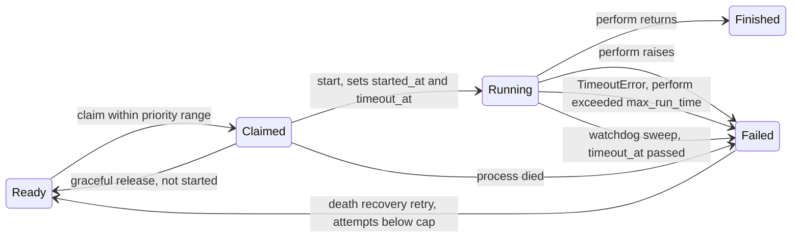

# Solid Queue core changes

Every change works on the SQL and MongoDB backends. Each backend operation is added to `test/shared/persistence_contract.rb`, and its behaviour to a `test/shared/*_behaviour.rb` suite that both backends include.

## Claim lifecycle with the new states

## 1. Priority range claims (rank 9)

Workers accept `min_priority:` and `max_priority:` (either, both or neither). `ReadyExecution.claim(queues, limit, process_id, priority: range)` filters candidates to `priority BETWEEN min AND max`. The ready-poll indexes already lead with `queue_name, priority`, so the filter is a range scan on the existing indexes on both backends.

- Config: `workers: [{ queues: "*", min_priority: 0, max_priority: 10 }]`
- Metadata and procline show the range.
- `aggregated_count_across` accepts the same range, so drain mode counts only the jobs this worker can take.

## 2. Run-time watchdog (rank 3)

`limits_run_time max: 30.minutes` on a job, and `config.solid_queue.max_run_time` globally. A job's limit is `min(job, global)`.

- **In-process bound.** `ClaimedExecution#perform` wraps `execute` in `Timeout.timeout(limit, SolidQueue::Processes::RunTimeExceededError)`. With thread pools this interrupts one thread; under the Async fiber scheduler it interrupts one fiber.
- **Durable bound.** `start` stores `timeout_at = now + limit + grace` on the claim in the same guarded update as `started_at` (every claim with a limit records it, deduplicated or not).
- **Sweep.** Supervisor maintenance fails claims whose `timeout_at` has passed with `RunTimeExceededError`, through the ownership-guarded `failed_with`, and emits `run_time_exceeded.solid_queue` with `job_id`, `process_id`, `max_run_time`, `started_at`.
- Schema: SQL `solid_queue_claimed_executions.timeout_at` + index; MongoDB `timeout_at` field + partial index `{ timeout_at: 1 }` where `state: "claimed"`.

## 3. Drain mode (rank 8) and `work_off` (rank 4)

- **`SolidQueue.work_off(queues: "*", limit: 100, priority: nil)`** dispatches due scheduled jobs, then claims and performs ready jobs inline in the calling thread until `limit` jobs have run or none are left. Returns `SolidQueue::WorkOff::Result` with `successes`, `failures`, `to_a` → `[successes, failures]`. Emits `work_off.solid_queue`.
- **`exit_on_complete: true`** on a worker (config or `bin/jobs --exit-on-complete`) stops the whole supervisor once no ready or due-scheduled jobs in the worker's queues and priority range remain and every claim has finished. Emits `drained.solid_queue`.

## 4. Death recovery retry (rank 6)

`config.solid_queue.retry_on_process_death = { attempts: 3 }`, off by default. When claims are failed with `ProcessPrunedError`, `ProcessExitError` or `ProcessMissingError`, each job whose Active Job `executions` is below the cap is retried through the normal `FailedExecution#retry` path (so batches, concurrency and deduplication stay consistent). Emits `death_recovery.solid_queue` with `job_ids`, `retried`, `exhausted`.

## 5. Execution hooks (rank 11)

`SolidQueue::ExecutionHooks` exposes `around_claim`, `around_perform`, `on_failure` and `around_poll` registries: `SolidQueue.around_perform { |execution, &block| ...; block.call; ... }`. Hooks run in registration order, wrap the existing code paths in `Worker#poll` and `ClaimedExecution#perform`, and see backend-neutral objects (`execution.job_id`, `execution.job`, `execution.process_id`).

## 6. Operations tasks (ranks 13, 14)

- `bin/rails solid_queue:check_latency[max_age]` exits non-zero when ready jobs older than `max_age` seconds exist (default 300), printing count and oldest age. Backed by `SolidQueue::Queue#latency` across all queues.
- `bin/rails solid_queue:clear[queue]` discards ready, scheduled, blocked and failed jobs in one queue, or all queues when omitted. Claimed jobs are left to finish.

## 7. Names (rank 18)

`SolidQueue::Job#display_name` returns the Active Job's `display_name` when its class defines one (the shim supplies `User#welcome`), else `class_name`. The log subscriber and `Admin` use it; notifications add `display_name` to claim, perform and failure payloads.

## Observability

New events: `run_time_exceeded`, `work_off`, `drained`, `death_recovery`, `check_latency`. Each gets a log-subscriber line. Existing claim, perform and failure payloads gain `display_name`, and claim payloads gain `priority_range`.
