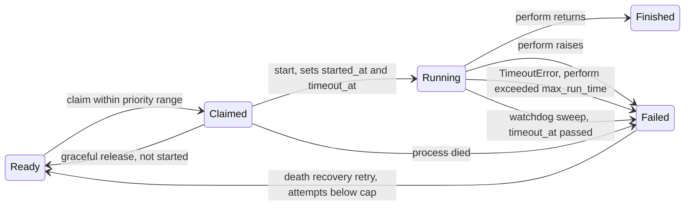

# Solid Queue core changes

Every change works on the SQL and MongoDB backends. Each backend operation is added to `test/shared/persistence_contract.rb`, and its behaviour to a `test/shared/*_behaviour.rb` suite that both backends include.

## Claim lifecycle with the new states

## 1. Priority range claims (rank 9)

Workers accept `min_priority:` and `max_priority:` (either, both or neither). Configuration validation requires integers and `min_priority <= max_priority`. `ReadyExecution.claim(queues, limit, process_id, priority: range)` takes any Range, bounded or open-ended, and filters candidates to it. SQL adds the range to each relation from `QueueSelector`, so polling stays on `[queue_name, priority, job_id]` or `[priority, job_id]`. MongoDB adds `$gte`/`$lte` bounds to the hinted `ready_poll_by_queue_v2` / `ready_poll_all_v2` scan; `test/mongodb/query_hints_test.rb` checks the index bounds and that no in-memory sort runs.

- Config: `workers: [{ queues: "*", min_priority: 0, max_priority: 10 }]`
- Metadata gains `priority_range` (`"0..10"`, `"5.."`, `"..10"`). The procline reads `waiting for jobs in * with priorities 0..10`.
- `aggregated_count_across` and `ScheduledExecution.due_count_across` accept the same range, so drain mode counts only the jobs this worker can take.

## 2. Run-time watchdog (rank 3)

`limits_run_time max: 30.minutes` on a job (`ActiveJob::RunTimeLimit`, positive durations only), and `config.solid_queue.max_run_time` globally (nil, the default, means no limit). A job's limit, `SolidQueue::Job#run_time_limit`, is `min(job, global)` ignoring nils.

- **In-process bound.** `ClaimedExecution#perform` wraps `execute` in `Timeout.timeout(limit, SolidQueue::Processes::RunTimeExceededError)`. The error subclasses `Timeout::Error`, so Active Job `retry_on` handles it. With thread pools this interrupts one thread; under the Async fiber scheduler it interrupts one fiber.
- **Durable bound.** `start` stores `started_at` and `timeout_at = now + limit + config.solid_queue.run_time_grace` (default 30 seconds) in the same ownership-guarded update, for every claim with a limit. A started claim is never released for a second run.
- **Sweep.** Supervisor maintenance calls `ClaimedExecution.fail_timed_out`, which fails claims whose `timeout_at` has passed with `RunTimeExceededError` through the ownership-guarded `failed_with`, returns the number it failed, and emits `run_time_exceeded.solid_queue` with `job_id`, `process_id`, `max_run_time`, `started_at` and `display_name` for each.
- Schema: SQL `solid_queue_claimed_executions.timeout_at` + `index_solid_queue_claimed_executions_on_timeout_at` (migration `add_run_time_limits_to_solid_queue`; without it only the in-process bound applies); MongoDB `timeout_at` field, unset whenever a document leaves the claimed state, + partial index `claimed_timeout` `{ timeout_at: 1 }` where `state: "claimed"`, hinted by the sweep.

## 3. Drain mode (rank 8) and `work_off` (rank 4)

- **`SolidQueue.work_off(queues: "*", limit: 100, priority: nil)`** dispatches due scheduled jobs, then claims and performs ready jobs one at a time in the calling thread until `limit` jobs have run or none are left. It dispatches again whenever no ready job is left, so jobs that become due mid-run are picked up. Returns `SolidQueue::WorkOff::Result` with `successes`, `failures`, `to_a` → `[successes, failures]`.
  - It claims as a transient `Worker` process named `work_off-<pid>-<hex>`. The process heartbeats, so maintenance doesn't prune it mid-job, and is deregistered in `ensure`.
  - A job raising a `StandardError` counts as a failure and is reported through `on_thread_error`, like pool threads. Other exceptions and `UnrecoverableError` propagate after deregistration.
  - Emits `work_off.solid_queue` with `queues`, `limit`, `priority`, `successes`, `failures`.
- **`exit_on_complete: true`** on a worker (config or `bin/jobs --exit-on-complete`, which sets it on every worker) stops the whole supervisor once a poll finds all of the following:
  - the pool idle;
  - no due scheduled job in the worker's queues and priority range (`ScheduledExecution.due_count_across`). This is counted first, so a job moving from scheduled to ready isn't missed;
  - no ready job there either.

  Emits `drained.solid_queue` with `process_id`, `name`, `queues`, `priority_range`. How the supervisor stops depends on the mode:
  - **Fork mode:** the worker sends `TERM` to its supervisor, which terminates gracefully as for an operator `TERM`.
  - **Async mode:** the supervisor sees the drained worker in its supervise loop (within a second). A standalone supervisor handles it as `TERM`; an embedded one stops in-process.
  - **Unsupervised:** the worker stops itself.

  Jobs outside the worker's queues or range, and future scheduled jobs, don't hold it back.

## 4. Death recovery retry (rank 6)

`config.solid_queue.retry_on_process_death = { attempts: 3 }`, off by default (nil); anything but a positive integer cap raises `ArgumentError` at boot. When `fail_for_process`, `fail_orphaned` or process pruning fail claims with `ProcessPrunedError`, `ProcessExitError` or `ProcessMissingError`, `SolidQueue::DeathRecovery.recover(job_ids, error)` re-reads each job and retries it through `FailedExecution#retry(interrupted: true)` if its recorded failure is one of those errors and its Active Job `executions`, counting the interrupted run, is below the cap. `interrupted: true` increments `executions` instead of resetting the counters; the rest is the normal retry path, so batches and concurrency stay consistent. On MongoDB recovery runs after the pruning transaction commits. Emits `death_recovery.solid_queue` with `job_ids`, `retried`, `exhausted` and `error`.

## 5. Execution hooks (rank 11)

`SolidQueue::ExecutionHooks` holds `around_claim`, `around_perform`, `around_poll` and `on_failure` registries, filled by `SolidQueue.around_perform { |execution, &block| ...; block.call; ... }` and its siblings. Hooks run in registration order, the first one outermost, and see backend-neutral objects (`execution.job_id`, `execution.job`, `execution.process_id`). `SolidQueue::ExecutionHooks.clear` empties every registry.

- `around_perform` wraps `ClaimedExecution#perform` on both backends. If a hook raises before calling its block, or returns without calling it, the claim is failed with that error or `ExecutionHooks::NotPerformedError` and the error is raised.
- `on_failure` runs with `(execution, error)` after `perform` records a failure. Errors it raises go to `on_thread_error`.
- The runner for the worker is `SolidQueue::ExecutionHooks.run(kind, *arguments) { ... }` with `kind` one of `:around_claim`, `:around_poll`, `:around_perform`. Each hook is called as `hook.call(*arguments, &inner)`. `run` returns the value of the wrapped block whatever the hooks return, runs the block at most once, yields straight away when no hooks are registered, and raises `ArgumentError` for any other `kind`. `Worker#poll` calls `ExecutionHooks.run(:around_poll, self) { ... }` around its polling cycle and `ExecutionHooks.run(:around_claim, self) { ReadyExecution.claim(...) }` around the claim, returning the claimed executions.

## 6. Operations tasks (ranks 13, 14)

- **`bin/rails solid_queue:check_latency[max_age]`** (default 300) checks ready jobs in all queues. When any have waited longer than `max_age` seconds, it prints `N ready jobs have waited longer than M seconds; the oldest has waited S seconds.` to stderr and exits 1. Otherwise it prints `OK: ...` and exits 0.
  - It is backed by `ReadyExecution.count_waiting_longer_than(age)` and `ReadyExecution.latency` on both backends.
  - Both measure from the job's `scheduled_at` (its enqueue time when not scheduled), so a job scheduled far ahead isn't reported late when it becomes due.
  - Emits `check_latency.solid_queue` with `max_age`, `count`, `latency`.
- **`bin/rails solid_queue:clear[queue]`** discards blocked, scheduled, ready and failed jobs in one queue, or in all queues when the queue is omitted, then prints the number discarded.
  - It uses `Execution.discard_all_in_queue(queue)` or `discard_all_in_batches` on both backends; each emits the existing `discard_all.solid_queue`.
  - Claimed jobs are left to finish, and `ClaimedExecution.discard_all_in_queue` raises `UndiscardableError`.

## 7. Names (rank 18)

`SolidQueue::Job#display_name` returns the Active Job's `display_name` when its class defines one (the shim supplies `User#welcome`), computed from `ActiveJob::Base.deserialize(job.arguments)` with the arguments deserialized, and falls back to `class_name` when the class is missing, doesn't define it, or raises. `SolidQueue::Admin.job_attributes` includes it. Notifications add `display_names` (by job ID, from `ClaimedExecution.display_names_for(executions)`) to `fail_many_claimed`, and `display_name` to `release_claimed` and `run_time_exceeded`; the log subscriber prints them. Claim payloads don't carry display names: computing them would deserialize arguments inside the claim transaction, so a perform-level event outside that transaction is the place to add them.

## 8. Delivery modes

`test/shared/delivery_guarantees_behaviour.rb` proves that `:at_least_once`, the default, matches delayed_job's at-least-once with exclusive runs: concurrent threads (and forked processes on MongoDB) perform every job once; a finished job is never claimed again; a stale owner can't finish, fail or release a newer owner's claim; a claim whose process died runs once more with `retry_on_process_death`; the sweep fails a job past its run-time limit, which isn't retried as a death. No gaps turned up.

`ActiveJob::DeliveryModes`, included next to `ActiveJob::RunTimeLimit`, adds `delivers(mode)`, the class attribute `delivery_mode`, the instance method `delivery_mode` (the class's mode, else `SolidQueue.default_delivery_mode`), and `retries_on_process_death(attempts:)`. `config.solid_queue.default_delivery_mode` and `delivers` reject anything but `:at_least_once`, `:at_most_once` and `:exactly_once`. The instance's mode is resolved at enqueue and stored: SQL `solid_queue_jobs.delivery_mode` (migration `add_delivery_modes_to_solid_queue`; without it the class's mode applies at perform time), MongoDB field `delivery_mode`. `SolidQueue::Job#delivery_mode`, `#at_most_once?` and `#exactly_once?` read it.

- **`:at_most_once`.** `perform` runs only after the ownership-guarded `start` records `started_at`, as for run-time-limited jobs. Death paths fail a started claim, and `ClaimedExecution#rerunnable?` keeps it out of death recovery.
- **`:exactly_once`.** `ClaimedExecution#perform` runs `start`, `perform` and the success finalization in one transaction: `SolidQueue::Record.transaction` on SQL, `SolidQueue::Mongo.transaction(operation: "perform_exactly_once")` on MongoDB. `perform` raising rolls it back; `failed_with` and `on_failure` then run outside it. A prepended `around_perform` wraps each Active Job attempt in `ClaimedExecution#within_attempt`: a savepoint on SQL, and on MongoDB `SolidQueue::Mongo.restart_transaction`, which aborts the attempt's writes, starts a new transaction on the same session and starts the claim again, so errors that `retry_on` or `discard_on` handle roll back only the attempt. `SolidQueue.exactly_once_session` returns the transaction's `Mongo::Session` during the perform on MongoDB.
- **Death.** `fail_all_with` (SQL) and `fail_many` (MongoDB) partition out `uncommitted_exactly_once?` claims and call `release_uncommitted(error)` on each, outside any transaction the death path holds. SQL locks the claim row with `non_blocking_lock`; MongoDB runs a `find_one_and_update` hinted on `_id` with `maxTimeMS: 250`. The release counts the interrupted run in `executions`; once `DeathRecovery.uncommitted_exhausted?` (executions counting this run reach the job's cap) the claim is failed with the process error instead. A claim still locked by an open transaction returns `:locked` for a later tick. On MongoDB process pruning releases after its transaction commits. `release` (graceful shutdown) uses the same release without counting.
- **Timeout.** `run_time_limit` of an exactly-once job includes `config.solid_queue.exactly_once_timeout` on both backends: 50 seconds, 10 seconds below MongoDB's default `transactionLifetimeLimitSeconds`, leaving time to roll back or record the outcome.
- **Attempts.** `ActiveJob::DeliveryModes.within_attempt(&block)` calls the current execution's `within_attempt`, or yields outside an exactly-once perform; the prepended `around_perform` uses it for each Active Job attempt. Every call is an attempt: SQL `transaction(requires_new: true)` gives each level a savepoint; MongoDB restarts the transaction when a level fails, which also discards the enclosing levels' earlier writes.
- **Per-job cap.** `DeathRecovery.attempts_for(job)` is the class's `process_death_attempts`, else `retry_on_process_death[:attempts]`; recovery skips jobs without one.
- **Events.** `perform_exactly_once` (`job_id`, `process_id`, `display_name`, `run_time_limit`, `outcome`: `:committed`, `:rolled_back`, `:conflict`) and `release_uncommitted` (`job_ids`, `released`, `exhausted`, `locked`, `process_ids`, `display_names`, `size`, `error`), both logged.
- Tests: `test/shared/delivery_guarantees_behaviour.rb` and `test/shared/exactly_once_behaviour.rb` on both backends, plus MongoDB failpoint, forked `SIGKILL`, lock-conflict and hint tests in `test/mongodb/exactly_once_test.rb` and a missing-column test in `test/models/solid_queue/exactly_once_test.rb`. The operations are in `test/shared/persistence_contract.rb`. [delivery_modes.md](delivery_modes.md) compares the modes with delayed_job.

## Observability

New events: `run_time_exceeded`, `work_off`, `drained`, `death_recovery`, `check_latency`, `perform_exactly_once`, `release_uncommitted`. Each gets a log-subscriber line. Existing claim, perform and failure payloads gain `display_name`, and claim payloads gain `priority_range`.
