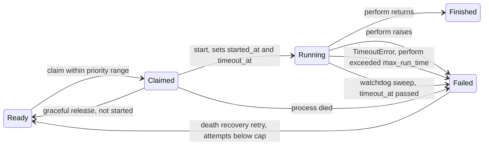

# Solid Queue core changes

Every change works on the SQL and MongoDB backends. Each backend operation is added to `test/shared/persistence_contract.rb`, and its behaviour to a `test/shared/*_behaviour.rb` suite that both backends include.

## Claim lifecycle with the new states

## 1. Priority range claims (rank 9)

Workers accept `min_priority:` and `max_priority:` (either, both or neither). `ReadyExecution.claim(queues, limit, process_id, priority: range)` filters candidates to `priority BETWEEN min AND max`. The ready-poll indexes already lead with `queue_name, priority`, so the filter is a range scan on the existing indexes on both backends.

- Config: `workers: [{ queues: "*", min_priority: 0, max_priority: 10 }]`
- Metadata and procline show the range.
- `aggregated_count_across` accepts the same range, so drain mode counts only the jobs this worker can take.

## 2. Run-time watchdog (rank 3)

`limits_run_time max: 30.minutes` on a job (`ActiveJob::RunTimeLimit`, positive durations only), and `config.solid_queue.max_run_time` globally (nil, the default, means no limit). A job's limit, `SolidQueue::Job#run_time_limit`, is `min(job, global)` ignoring nils.

- **In-process bound.** `ClaimedExecution#perform` wraps `execute` in `Timeout.timeout(limit, SolidQueue::Processes::RunTimeExceededError)`. The error subclasses `Timeout::Error`, so Active Job `retry_on` handles it. With thread pools this interrupts one thread; under the Async fiber scheduler it interrupts one fiber.
- **Durable bound.** `start` stores `started_at` and `timeout_at = now + limit + config.solid_queue.run_time_grace` (default 30 seconds) in the same ownership-guarded update, for every claim with a limit or a deduplication key. A started claim is never released for a second run.
- **Sweep.** Supervisor maintenance calls `ClaimedExecution.fail_timed_out`, which fails claims whose `timeout_at` has passed with `RunTimeExceededError` through the ownership-guarded `failed_with`, returns the number it failed, and emits `run_time_exceeded.solid_queue` with `job_id`, `process_id`, `max_run_time`, `started_at` and `display_name` for each.
- Schema: SQL `solid_queue_claimed_executions.timeout_at` + `index_solid_queue_claimed_executions_on_timeout_at` (migration `add_run_time_limits_to_solid_queue`; without it only the in-process bound applies); MongoDB `timeout_at` field, unset whenever a document leaves the claimed state, + partial index `claimed_timeout` `{ timeout_at: 1 }` where `state: "claimed"`, hinted by the sweep.

## 3. Drain mode (rank 8) and `work_off` (rank 4)

- **`SolidQueue.work_off(queues: "*", limit: 100, priority: nil)`** dispatches due scheduled jobs, then claims and performs ready jobs inline in the calling thread until `limit` jobs have run or none are left. Returns `SolidQueue::WorkOff::Result` with `successes`, `failures`, `to_a` → `[successes, failures]`. Emits `work_off.solid_queue`.
- **`exit_on_complete: true`** on a worker (config or `bin/jobs --exit-on-complete`) stops the whole supervisor once no ready or due-scheduled jobs in the worker's queues and priority range remain and every claim has finished. Emits `drained.solid_queue`.

## 4. Death recovery retry (rank 6)

`config.solid_queue.retry_on_process_death = { attempts: 3 }`, off by default (nil); anything but a positive integer cap raises `ArgumentError` at boot. When `fail_for_process`, `fail_orphaned` or process pruning fail claims with `ProcessPrunedError`, `ProcessExitError` or `ProcessMissingError`, `SolidQueue::DeathRecovery.recover(job_ids, error)` re-reads each job and retries it through `FailedExecution#retry(interrupted: true)` if its recorded failure is one of those errors and its Active Job `executions`, counting the interrupted run, is below the cap. `interrupted: true` increments `executions` instead of resetting the counters; the rest is the normal retry path, so batches, concurrency and deduplication stay consistent. On MongoDB recovery runs after the pruning transaction commits. Emits `death_recovery.solid_queue` with `job_ids`, `retried`, `exhausted` and `error`.

## 5. Execution hooks (rank 11)

`SolidQueue::ExecutionHooks` holds `around_claim`, `around_perform`, `around_poll` and `on_failure` registries, filled by `SolidQueue.around_perform { |execution, &block| ...; block.call; ... }` and its siblings. Hooks run in registration order, the first one outermost, and see backend-neutral objects (`execution.job_id`, `execution.job`, `execution.process_id`). `SolidQueue::ExecutionHooks.clear` empties every registry.

- `around_perform` wraps `ClaimedExecution#perform` on both backends. If a hook raises before calling its block, or returns without calling it, the claim is failed with that error or `ExecutionHooks::NotPerformedError` and the error is raised.
- `on_failure` runs with `(execution, error)` after `perform` records a failure. Errors it raises go to `on_thread_error`.
- The runner for the worker is `SolidQueue::ExecutionHooks.run(kind, *arguments) { ... }` with `kind` one of `:around_claim`, `:around_poll`, `:around_perform`. Each hook is called as `hook.call(*arguments, &inner)`. `run` returns the value of the wrapped block whatever the hooks return, runs the block at most once, yields straight away when no hooks are registered, and raises `ArgumentError` for any other `kind`. `Worker#poll` calls `ExecutionHooks.run(:around_poll, self) { ... }` around its polling cycle and `ExecutionHooks.run(:around_claim, self) { ReadyExecution.claim(...) }` around the claim, returning the claimed executions.

## 6. Operations tasks (ranks 13, 14)

- `bin/rails solid_queue:check_latency[max_age]` exits non-zero when ready jobs older than `max_age` seconds exist (default 300), printing count and oldest age. Backed by `SolidQueue::Queue#latency` across all queues.
- `bin/rails solid_queue:clear[queue]` discards ready, scheduled, blocked and failed jobs in one queue, or all queues when omitted. Claimed jobs are left to finish.

## 7. Names (rank 18)

`SolidQueue::Job#display_name` returns the Active Job's `display_name` when its class defines one (the shim supplies `User#welcome`), computed from `ActiveJob::Base.deserialize(job.arguments)` with the arguments deserialized, and falls back to `class_name` when the class is missing, doesn't define it, or raises. `SolidQueue::Admin.job_attributes` includes it. Notifications add `display_names` (by job ID, from `ClaimedExecution.display_names_for(executions)`) to `fail_many_claimed`, and `display_name` to `release_claimed` and `run_time_exceeded`; the log subscriber prints them. Claim payloads don't carry display names: computing them would deserialize arguments inside the claim transaction, so a perform-level event outside that transaction is the place to add them.

## Observability

New events: `run_time_exceeded`, `work_off`, `drained`, `death_recovery`, `check_latency`. Each gets a log-subscriber line. Existing claim, perform and failure payloads gain `display_name`, and claim payloads gain `priority_range`.
