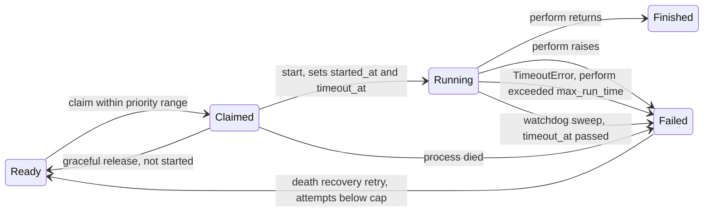

# Solid Queue core changes

Every change works on the SQL and MongoDB backends. Each backend operation is added to `test/shared/persistence_contract.rb`, and its behaviour to a `test/shared/*_behaviour.rb` suite that both backends include.

## Claim lifecycle with the new states

## 1. Priority range claims (rank 9)

Workers accept `min_priority:` and `max_priority:` (either, both or neither). Configuration validation requires integers and `min_priority <= max_priority`. `ReadyExecution.claim(queues, limit, process_id, priority: range)` takes any Range, bounded or open-ended, and filters candidates to it. SQL adds the range to each relation from `QueueSelector`, so polling stays on `[queue_name, priority, job_id]` or `[priority, job_id]`. MongoDB adds `$gte`/`$lte` bounds to the hinted `ready_poll_by_queue_v2` / `ready_poll_all_v2` scan; `test/mongodb/query_hints_test.rb` checks the index bounds and that no in-memory sort runs.

- Config: `workers: [{ queues: "*", min_priority: 0, max_priority: 10 }]`
- Metadata gains `priority_range` (`"0..10"`, `"5.."`, `"..10"`). The procline reads `waiting for jobs in * with priorities 0..10`.
- `aggregated_count_across` and `ScheduledExecution.due_count_across` accept the same range, so drain mode counts only the jobs this worker can take.

## 2. Run-time watchdog (rank 3)

`limits_run_time max: 30.minutes` on a job, and `config.solid_queue.max_run_time` globally. A job's limit is `min(job, global)`.

- **In-process bound.** `ClaimedExecution#perform` wraps `execute` in `Timeout.timeout(limit, SolidQueue::Processes::RunTimeExceededError)`. With thread pools this interrupts one thread; under the Async fiber scheduler it interrupts one fiber.
- **Durable bound.** `start` stores `timeout_at = now + limit + grace` on the claim in the same guarded update as `started_at` (every claim with a limit records it, deduplicated or not).
- **Sweep.** Supervisor maintenance fails claims whose `timeout_at` has passed with `RunTimeExceededError`, through the ownership-guarded `failed_with`, and emits `run_time_exceeded.solid_queue` with `job_id`, `process_id`, `max_run_time`, `started_at`.
- Schema: SQL `solid_queue_claimed_executions.timeout_at` + index; MongoDB `timeout_at` field + partial index `{ timeout_at: 1 }` where `state: "claimed"`.

## 3. Drain mode (rank 8) and `work_off` (rank 4)

- **`SolidQueue.work_off(queues: "*", limit: 100, priority: nil)`** dispatches due scheduled jobs, then claims and performs ready jobs one at a time in the calling thread until `limit` jobs have run or none are left. It dispatches again whenever no ready job is left, so jobs that become due mid-run are picked up. Returns `SolidQueue::WorkOff::Result` with `successes`, `failures`, `to_a` → `[successes, failures]`.
  - It claims as a transient `Worker` process named `work_off-<pid>-<hex>`. The process heartbeats, so maintenance doesn't prune it mid-job, and is deregistered in `ensure`.
  - A job raising a `StandardError` counts as a failure and is reported through `on_thread_error`, like pool threads. Other exceptions and `UnrecoverableError` propagate after deregistration.
  - Emits `work_off.solid_queue` with `queues`, `limit`, `priority`, `successes`, `failures`.
- **`exit_on_complete: true`** on a worker (config or `bin/jobs --exit-on-complete`, which sets it on every worker) stops the whole supervisor once a poll finds all of the following:
  - the pool idle;
  - no due scheduled job in the worker's queues and priority range (`ScheduledExecution.due_count_across`). This is counted first, so a job moving from scheduled to ready isn't missed;
  - no ready job there either.

  Emits `drained.solid_queue` with `process_id`, `name`, `queues`, `priority_range`. How the supervisor stops depends on the mode:
  - **Fork mode:** the worker sends `TERM` to its supervisor, which terminates gracefully as for an operator `TERM`.
  - **Async mode:** the supervisor sees the drained worker in its supervise loop (within a second). A standalone supervisor handles it as `TERM`; an embedded one stops in-process.
  - **Unsupervised:** the worker stops itself.

  Jobs outside the worker's queues or range, and future scheduled jobs, don't hold it back.

## 4. Death recovery retry (rank 6)

`config.solid_queue.retry_on_process_death = { attempts: 3 }`, off by default. When claims are failed with `ProcessPrunedError`, `ProcessExitError` or `ProcessMissingError`, each job whose Active Job `executions` is below the cap is retried through the normal `FailedExecution#retry` path (so batches, concurrency and deduplication stay consistent). Emits `death_recovery.solid_queue` with `job_ids`, `retried`, `exhausted`.

## 5. Execution hooks (rank 11)

`SolidQueue::ExecutionHooks` exposes `around_claim`, `around_perform`, `on_failure` and `around_poll` registries: `SolidQueue.around_perform { |execution, &block| ...; block.call; ... }`. Hooks run in registration order, wrap the existing code paths in `Worker#poll` and `ClaimedExecution#perform`, and see backend-neutral objects (`execution.job_id`, `execution.job`, `execution.process_id`).

## 6. Operations tasks (ranks 13, 14)

- **`bin/rails solid_queue:check_latency[max_age]`** (default 300) checks ready jobs in all queues. When any have waited longer than `max_age` seconds, it prints `N ready jobs have waited longer than M seconds; the oldest has waited S seconds.` to stderr and exits 1. Otherwise it prints `OK: ...` and exits 0.
  - It is backed by `ReadyExecution.count_waiting_longer_than(age)` and `ReadyExecution.latency` on both backends.
  - Both measure from the job's `scheduled_at` (its enqueue time when not scheduled), so a job scheduled far ahead isn't reported late when it becomes due.
  - Emits `check_latency.solid_queue` with `max_age`, `count`, `latency`.
- **`bin/rails solid_queue:clear[queue]`** discards blocked, scheduled, ready and failed jobs in one queue, or in all queues when the queue is omitted, then prints the number discarded.
  - It uses `Execution.discard_all_in_queue(queue)` or `discard_all_in_batches` on both backends; each emits the existing `discard_all.solid_queue`.
  - Claimed jobs are left to finish, and `ClaimedExecution.discard_all_in_queue` raises `UndiscardableError`.

## 7. Names (rank 18)

`SolidQueue::Job#display_name` returns the Active Job's `display_name` when its class defines one (the shim supplies `User#welcome`), else `class_name`. The log subscriber and `Admin` use it; notifications add `display_name` to claim, perform and failure payloads.

## Observability

New events: `run_time_exceeded`, `work_off`, `drained`, `death_recovery`, `check_latency`. Each gets a log-subscriber line. Existing claim, perform and failure payloads gain `display_name`, and claim payloads gain `priority_range`.
