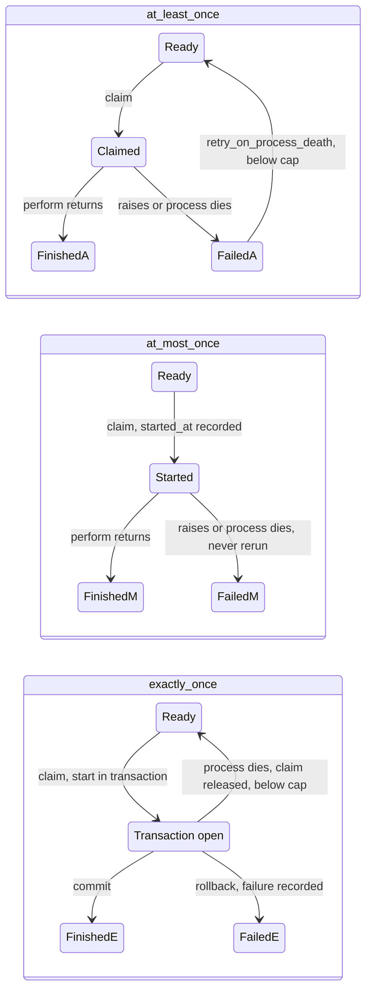

# Delivery modes: delayed_job and Solid Queue

## delayed_job

`Delayed::Worker#reserve_and_run_one_job` reserves a job with `Delayed::Job.reserve`, which takes an exclusive lock on one row (`locked_by`, `locked_at`). `run` performs it inside `Timeout.timeout(max_run_time)` and deletes the row when `perform` returns. When `perform` raises, `reschedule` unlocks the row with a later `run_at`, until `max_attempts`. A row locked by a worker that died is reserved again once `locked_at` is older than `max_run_time`, and runs again from the start.

So one worker at a time runs a job, a finished job is gone, and a job whose worker died runs again: at-least-once, with exclusive runs. The effects of a run that died before its row was deleted are not undone.

## Solid Queue delivery modes

`delivers :at_least_once | :at_most_once | :exactly_once` on a job class, or `config.solid_queue.default_delivery_mode` for jobs whose class sets none (`:at_least_once` by default). Anything else raises `ArgumentError`. The mode comes from the Active Job instance's `delivery_mode`, is resolved at enqueue and stored with the job (SQL `solid_queue_jobs.delivery_mode`, MongoDB `delivery_mode` field), and `SolidQueue::Job#delivery_mode` reads it back. A job whose SQL row has no stored mode, before the `add_delivery_modes_to_solid_queue` migration, uses its class's mode when it runs.

## `:at_least_once`: delayed_job's guarantee

Every job in this mode gets delayed_job's guarantee, on both backends. `test/shared/delivery_guarantees_behaviour.rb` proves each part on SQL and MongoDB.

| delayed_job | Solid Queue |
| --- | --- |
| `lock_exclusively!` on one row | `ReadyExecution.claim` moves a job to claimed for one process (SQL: `FOR UPDATE SKIP LOCKED` and a unique `job_id` on claimed executions; MongoDB: a conditional `update_many` with a `claim_token`) |
| row deleted on success | `ClaimedExecution#perform` finishes the job and removes the claim; a finished job is never claimed again |
| `reschedule` on error | Active Job `retry_on` enqueues the next attempt; otherwise the job is failed |
| rerun after `max_run_time` | the claim of a dead process is failed by process pruning, the orphan sweep or the supervisor when a fork exits; `retry_on_process_death` or the class's `retries_on_process_death` retries it |
| `Timeout.timeout(max_run_time)` | `limits_run_time` / `max_run_time` interrupt `perform`, and the supervisor sweep fails claims past `timeout_at` |

Details the suite checks:

- Concurrent claimers (6 threads over 120 jobs; on MongoDB also 3 forked processes over 300 jobs) perform every job exactly once.
- A stale owner can't finish, fail or release a claim now held by a newer owner. SQL finalization locks the claim row by its ID; MongoDB matches `process_id`, `claim_token` and `claim_generation`.
- A claim whose process died mid-perform runs again exactly once more with `retry_on_process_death`, then stays finished.
- A job past its run-time limit is failed by the sweep with `RunTimeExceededError`. That isn't a process death, so death recovery doesn't retry it; use `retry_on SolidQueue::Processes::RunTimeExceededError` for that.
- A stale owner whose process was presumed dead can still run a job it had claimed, as a delayed_job worker whose lock expired can.

## `:at_most_once`

The ownership-guarded start that deduplicated and run-time-limited jobs already use records `started_at` before `perform`. A started claim is never released on graceful shutdown or performed a second time, whether by its own or a stale owner. When its process dies it is failed, and death recovery skips it even with `retry_on_process_death`. An unstarted claim never ran, so it is released or retried like any other. Errors raised inside `perform` go through Active Job, so `retry_on` retries them as new attempts.

## `:exactly_once`

`ClaimedExecution#perform` runs the claim start (`started_at`), `perform` and the success finalization in one queue-database transaction. It commits once, when `perform` returns, and otherwise rolls back:

- **SQL:** `SolidQueue::Record.transaction`. It includes every `perform_later` from `perform`, and writes through models that use `SolidQueue::Record`'s connection: its subclasses, or every model when Solid Queue shares the application's database without `connects_to`. A model with its own `connects_to` has its own connection pool and isn't included, even for the same database.
- **MongoDB:** an owned `SolidQueue::Mongo.transaction`. While `perform` runs, `SolidQueue.exactly_once_session` returns its `Mongo::Session`; `SolidQueue::Mongo.client` and `SolidQueue::Mongo.session_options` use it, and so do enqueues. Pass the session to your own driver calls: `client[:payments].insert_one(doc, session: SolidQueue.exactly_once_session)`. The client must be on the queue's cluster.

What happens in each case:

- **`perform` returns.** The effects, the enqueues and the job's completion commit together.
- **`perform` raises.** The transaction rolls back, then the failure is recorded outside it through the normal path: failed execution, `on_failure` hooks, batch accounting.
- **An error handled by `retry_on` or `discard_on`.** The attempt's own writes roll back to a savepoint (SQL) or with a restarted transaction (MongoDB). The retry enqueue and the completion commit.
- **The process dies mid-perform.** Nothing committed and the claim is unstarted, so pruning, the orphan sweep and fork-exit handling release it back to ready instead of failing it, and count the interrupted run in the job's `executions`. The job runs again and its effects happen once. Other modes keep their death behaviour.
- **The process keeps dying.** Once `executions` reaches the job's process-death cap (the class's `retries_on_process_death`, else `retry_on_process_death[:attempts]`, else 3), the next death fails the claim with the process-death error instead of releasing it.
- **`perform` runs too long.** Its run-time limit is the shortest of its `limits_run_time`, `max_run_time` and `config.solid_queue.exactly_once_timeout` (50 seconds, 10 seconds below MongoDB's default `transactionLifetimeLimitSeconds`, leaving time to roll back or record the outcome). Past it `perform` is interrupted with `RunTimeExceededError`, and the transaction rolls back and the failure is recorded, so the transaction is never held open past the limit or aborted by the server into a loop. A `perform` that rescues the error still has that headroom to commit what it does next, such as a reschedule.
- **A boundary inside `perform`.** `ActiveJob::DeliveryModes.within_attempt { ... }` marks an attempt: when its block raises, the block's writes and enqueues roll back and the error is re-raised, so a `perform` that rescues it commits only what follows. Attempts nest: on SQL each rolls back to its own savepoint; on MongoDB a failed attempt restarts the transaction and also discards writes the enclosing attempts made before it began. Outside an exactly-once perform it just yields.
- **A MongoDB `TransientTransactionError`.** The transaction runs again, `perform` included; nothing from the aborted attempt committed. Retries stop `mongo_transaction_timeout` after the first attempt began, and the job fails with `SolidQueue::Mongo::TransactionDeadlineExceeded`.

### Limits

- The transaction covers only the queue database. Writes to another database, HTTP calls, emails and files are outside it; a rerun repeats them. Make them idempotent or move them to a job enqueued from `perform`, which commits with the completion.
- On SQL, the transaction holds the claim row lock and any rows `perform` writes for the whole run. SQLite locks the whole database for a write transaction, so there an exactly-once perform blocks every other write to the queue database, other workers' claims included, until it ends. Keep exactly-once jobs short.
- On MongoDB, `perform` must finish within the server's `transactionLifetimeLimitSeconds` (60 seconds by default). Keep `exactly_once_timeout` below it and raise both together.
- On MongoDB, a dead process's open transaction keeps its document locks until the server aborts it. Sweeps release such a claim with a single-document update limited to 250 ms; on a lock conflict they report it in `locked` of `release_uncommitted` and release it on a later maintenance tick. A pruned process is removed even while its claims are locked; the orphan sweep releases them later.
- `SolidQueue.exactly_once_session` is nil outside an exactly-once perform, and on SQL.
- A job class with Active Job's `enqueue_after_transaction_commit` enabled is enqueued after the commit, outside the transaction.
- An exactly-once job's stale owner starts nothing and reports `:conflict`.
- Concurrency limits, batches and deduplication keep their semantics: a released claim keeps its semaphore, batch marker and deduplication key until the rerun finishes, and a claim failed at the crash-loop cap releases the semaphore and counts as failed in its batch.

## Per-job process-death cap

`retries_on_process_death attempts: N` (a positive Integer, `ArgumentError` otherwise) sets `process_death_attempts` on a job class. `DeathRecovery` resolves a job's cap from its class at recovery time: `process_death_attempts`, else `retry_on_process_death[:attempts]`, else no retry. The exactly-once crash-loop cap uses the same resolution, then 3.

## Notifications

- `perform_exactly_once.solid_queue`: `job_id`, `process_id`, `display_name`, `run_time_limit` (the effective limit), `outcome` (`:committed`, `:rolled_back`, or `:conflict` when this owner no longer holds the claim, so nothing ran). Logged at debug, info and warn.
- `release_uncommitted.solid_queue`: `job_ids` considered, `released`, `exhausted` (failed at the crash-loop cap), `locked` (left for a later sweep), `process_ids`, `display_names`, `size`, `error`. Death paths emit it instead of `fail_many_claimed` for these claims. Logged at info, or warn when a claim was exhausted.
