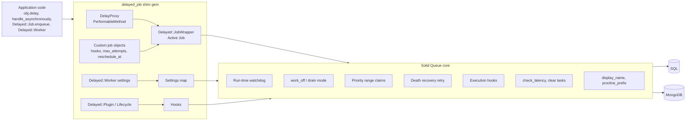

# delayed_job on Solid Queue — plan

Two deliverables share one contract:

- **Solid Queue core** (`alexandernicholson/solid_queue`, branch `main`): the generic runtime features ranks 3, 4, 6, 8, 9, 11, 13, 14 and 18 need. Built for both backends, covered by the shared contract and behaviour suites.
- **delayed_job shim** (`alexandernicholson/delayed_job`, branch `solid-queue-shim`): a gem named `delayed_job` that exposes delayed_job 4.2.0's public API on top of Solid Queue. Existing apps change their Gemfile, nothing else.

Priorities: stability, performance, observability.

## Items

Rank is usefulness for teams moving off delayed_job. Every item is test-first: each public method gets a failing test before code.

| # | Item | Where | Owner files | Test command |
|---|---|---|---|---|
| 1 | `obj.delay.method(args)`, `send_later`, `send_at`, `handle_asynchronously` | Shim | `lib/delayed/message_sending.rb`, `lib/delayed/performable_method.rb`, `lib/delayed/performable_mailer.rb` | `bundle exec rake test` |
| 2 | Default retries: 25 attempts, `5 + attempts**4` back-off, per-job `max_attempts`, `reschedule_at` | Shim | `lib/delayed/job_wrapper.rb`, `lib/delayed/retry_policy.rb` | `bundle exec rake test` |
| 3 | `max_run_time` watchdog (global and per job) | Core + shim map | core: `lib/solid_queue/watchdog.rb`, claim `timeout_at`; shim: settings map | core suites |
| 4 | `work_off(n)` returning `[successes, failures]` | Core + shim | core: `lib/solid_queue/work_off.rb`; shim: `Delayed::Worker#work_off` | both |
| 5 | `Delayed::Worker.delay_jobs` (boolean or proc) | Shim | `lib/delayed/worker.rb` | `bundle exec rake test` |
| 6 | Re-run claims failed by process death, capped | Core + shim default | core: `lib/solid_queue/death_recovery.rb`; shim: turns it on | both |
| 7 | `destroy_failed_jobs` | Shim | `lib/delayed/job_wrapper.rb` | `bundle exec rake test` |
| 8 | Drain mode: `jobs:workoff`, `--exit-on-complete` | Core + shim | core: worker `exit_on_complete`; shim: `lib/delayed/tasks.rb`, `lib/delayed/command.rb` | both |
| 9 | `--min-priority` / `--max-priority` | Core + shim | core: priority range on both claim paths; shim: flags | both |
| 10 | Procs for `priority:`, `queue:`, `run_at:` | Shim | `lib/delayed/message_sending.rb` | `bundle exec rake test` |
| 11 | `Delayed::Plugin` / `Delayed::Lifecycle` (enqueue, execute, loop, perform, error, failure, invoke_job) | Core hooks + shim | core: `lib/solid_queue/execution_hooks.rb`; shim: `lib/delayed/lifecycle.rb`, `lib/delayed/plugin.rb`, `lib/delayed/plugins/clear_locks.rb` | both |
| 12 | Mongoid documents as arguments (GlobalID) | Shim | `lib/delayed/mongoid.rb` | `bundle exec rake test` |
| 13 | `jobs:check[max_age]` | Core + shim | core: `solid_queue:check_latency`; shim: `lib/delayed/tasks.rb` | both |
| 14 | `jobs:clear` | Core + shim | core: `solid_queue:clear`; shim: `lib/delayed/tasks.rb` | both |
| 15 | `queue_attributes` (priority per queue) | Shim | `lib/delayed/backend/job_preparer.rb` | `bundle exec rake test` |
| 16 | `default_priority`, `default_queue_name` | Shim | `lib/delayed/backend/job_preparer.rb` | `bundle exec rake test` |
| 17 | `script/delayed_job start / stop / restart / status / run` | Shim | `lib/delayed/command.rb`, generator | `bundle exec rake test` |
| 18 | `display_name` in logs | Core + shim | core: log subscriber reads `display_name`; shim: `Class#method` | both |
| A | `Delayed::Job` facade (`enqueue`, `count`, `where`, `last_error`, `attempts`, `failed_at`, `run_at`, `delete_all`, `reserve`) | Shim | `lib/delayed/backend/solid_queue.rb`, `lib/delayed/backend/base.rb` | `bundle exec rake test` |
| B | `Delayed::Worker` settings and constants | Shim | `lib/delayed/worker.rb` | `bundle exec rake test` |
| C | `ActiveJob::QueueAdapters::DelayedJobAdapter` → Solid Queue | Shim | `lib/active_job/queue_adapters/delayed_job_adapter.rb` | `bundle exec rake test` |
| D | Import `delayed_jobs` rows into Solid Queue | Shim | `lib/delayed/import.rb`, `jobs:import` task | `bundle exec rake test` |
| E | Shim CI on both backends | Shim | `.github/workflows/ci.yml` | CI |

## Public surface the shim reproduces

Taken from delayed_job 4.2.0 `lib/`: `Delayed::Worker` (all `cattr_accessor` settings, `DEFAULT_*` constants, `reset`, `backend=`, `lifecycle`, `setup_lifecycle`, `delay_job?`, `before_fork`, `after_fork`, `reload_app?`, `#name`, `#start`, `#stop`, `#stop?`, `#work_off`, `#run`, `#reschedule`, `#failed`, `#job_say`, `#say`, `#max_attempts`, `#max_run_time`), `Delayed::Job` (`enqueue`, `enqueue_job`, `reserve`, `work_off`, `recover_from`, `before_fork`, `after_fork`, `#failed?`, `#name`, `#payload_object`, `#invoke_job`, `#unlock`, `#hook`, `#reschedule_at`, `#max_attempts`, `#max_run_time`, `#destroy_failed_jobs?`, `#fail!`), `Delayed::Backend::JobPreparer`, `Delayed::DelayProxy`, `Delayed::MessageSending`, `Delayed::MessageSendingClassMethods`, `Delayed::PerformableMethod`, `Delayed::PerformableMailer`, `Delayed::DelayMail`, `Delayed::Lifecycle`, `Delayed::Callback`, `Delayed::InvalidCallback`, `Delayed::Plugin`, `Delayed::Plugins::ClearLocks`, `Delayed::WorkerTimeout`, `Delayed::FatalBackendError`, `Delayed::DeserializationError`, `Delayed::Command` (every flag), `rake jobs:clear`, `jobs:work`, `jobs:workoff`, `jobs:check`, `DelayedJobGenerator`, `ActiveJob::QueueAdapters::DelayedJobAdapter`.

Out of scope for this plan (ranks 19+): YAML payloads for arbitrary objects, `-p`/`-i`/`--pid-dir` naming flags, Capistrano recipes. Their names exist and raise `NotImplementedError` with a pointer to these docs.
