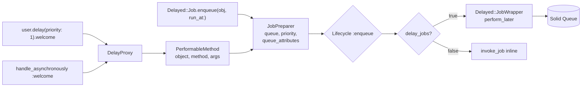
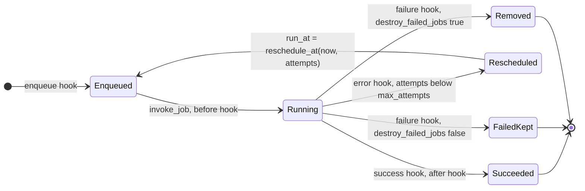
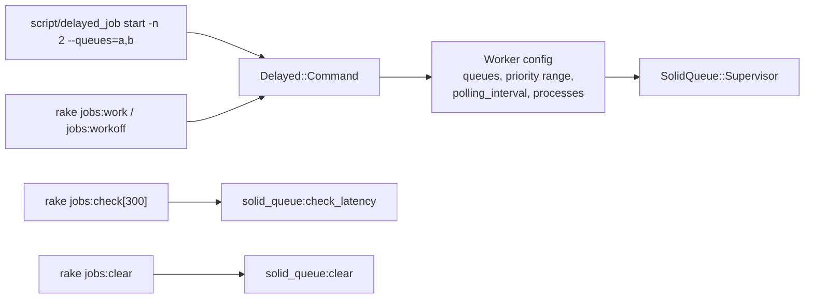

# delayed_job shim design

The gem is named `delayed_job`, version `4.2.0.sq1`, and depends on `solid_queue`. Apps swap it in and keep every `Delayed::*` call. Jobs are stored and run by Solid Queue on either backend.

## Enqueue path

`PerformableMethod` serializes `object` with Active Job's serializers: records and Mongoid documents by GlobalID, classes and modules by name, everything else Active Job accepts. `Delayed::JobWrapper` is the one Active Job class that carries every payload.

## Job run and retry

- `max_attempts`: the job's `max_attempts` method, else `Delayed::Worker.max_attempts` (25).
- `reschedule_at(now, attempts)`: the job's method, else `now + attempts**4 + 5`.
- `max_run_time`: `min(job.max_run_time, Delayed::Worker.max_run_time)`, handed to Solid Queue's run-time watchdog; a timeout raises `Delayed::WorkerTimeout`.
- Death: Solid Queue death recovery is on with `attempts: Delayed::Worker.max_attempts`, matching delayed_job's re-run of stale locks.

## Settings map

| `Delayed::Worker` | Solid Queue |
|---|---|
| `max_attempts`, `destroy_failed_jobs`, `reschedule_at` | shim retry policy |
| `max_run_time` | `config.solid_queue.max_run_time` |
| `sleep_delay` | worker `polling_interval` |
| `min_priority` / `max_priority` | worker `min_priority` / `max_priority` |
| `queues` | worker `queues` (empty → `*`) |
| `read_ahead` | stored; claims size to free pool capacity |
| `exit_on_complete` | worker `exit_on_complete` |
| `default_priority`, `default_queue_name`, `queue_attributes` | JobPreparer |
| `delay_jobs` | enqueue-time inline switch |
| `logger`, `default_log_level` | `SolidQueue.logger` + shim `say` |
| `plugins` | `Delayed::Lifecycle` on Solid Queue execution hooks |
| `raise_signal_exceptions` | stored; supervisor signal handling applies |

## Lifecycle events → Solid Queue hooks

| delayed_job event | Arguments | Runs from |
|---|---|---|
| `:enqueue` | job | `Delayed::Job.enqueue_job` |
| `:execute` | worker | `Delayed::Worker#start` and `bin/delayed_job` boot |
| `:loop` | worker | `SolidQueue.around_poll` |
| `:perform` | worker, job | `SolidQueue.around_perform` |
| `:invoke_job` | job | `Delayed::Job#invoke_job` |
| `:error` | worker, job | `Delayed::JobWrapper` rescue |
| `:failure` | worker, job | `SolidQueue.on_failure` / retries exhausted |

## `Delayed::Job` facade

`Delayed::Job` is `Delayed::Backend::SolidQueue::Job`. It reads through `SolidQueue::Admin` and `SolidQueue::Job`, so it works on SQL and MongoDB:

| delayed_job | Backed by |
|---|---|
| `id`, `priority`, `queue`, `run_at`, `created_at` | Solid Queue job |
| `attempts` | Active Job `executions` |
| `handler`, `payload_object`, `name` | serialized `PerformableMethod` / job object |
| `last_error`, `failed_at` | failed execution error |
| `locked_at`, `locked_by` | claimed execution, process name |
| `count`, `where(queue:, failed_at:, attempts:)`, `find`, `delete_all`, `destroy` | `SolidQueue::Admin` |
| `reserve(worker)`, `work_off(n)` | `SolidQueue.work_off` |

## Commands and tasks

`Delayed::Command` accepts every delayed_job flag. `start`, `stop`, `restart`, `status` and `run` manage the supervisor through its pidfile; `-n` and `--pool` become worker processes; `--min-priority`, `--max-priority`, `--sleep-delay`, `--queues`, `--exit-on-complete`, `-e`, `--log-dir` map to Solid Queue config.

## Observability

The shim publishes `enqueue.delayed_job`, `perform.delayed_job`, `retry.delayed_job`, `failure.delayed_job` and `timeout.delayed_job` through `ActiveSupport::Notifications`, each with `display_name`, `job_id`, `queue`, `priority`, `attempts`. Solid Queue's own `*.solid_queue` events keep flowing.

## Import

`rake jobs:import` moves unlocked, unfailed rows from a legacy `delayed_jobs` table into Solid Queue in batches of 500, keeping `run_at`, `priority`, `queue` and `attempts`, and deletes each row after its job is enqueued. It is idempotent: a row's id becomes its Active Job id.
